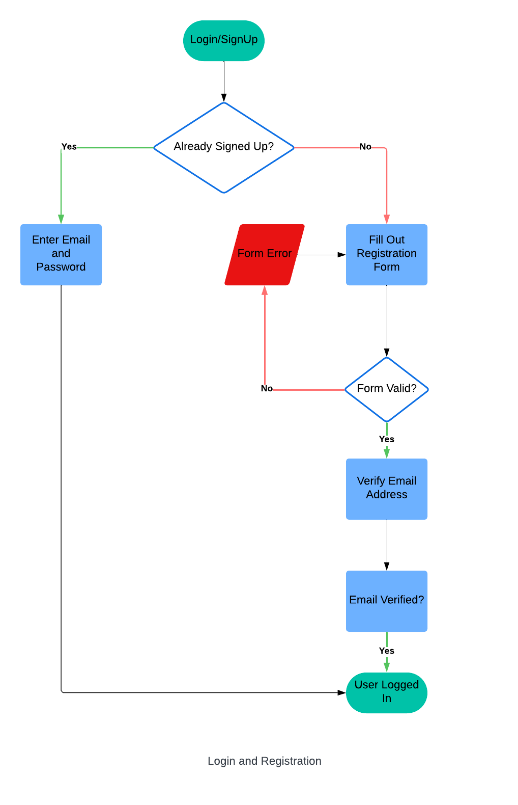
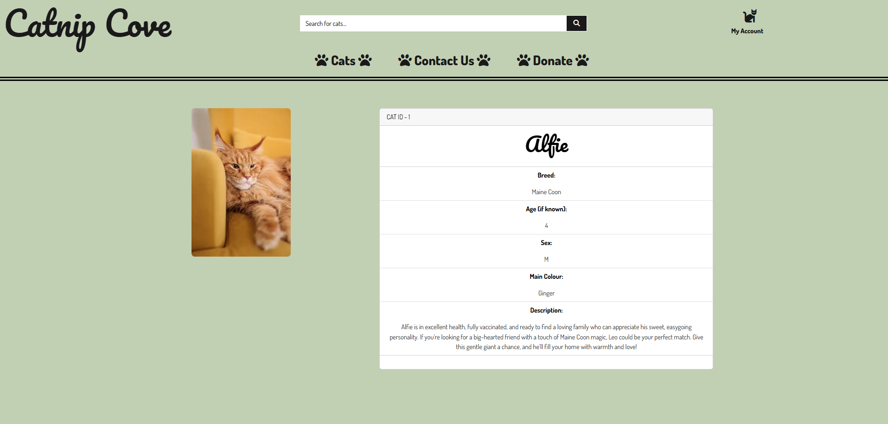
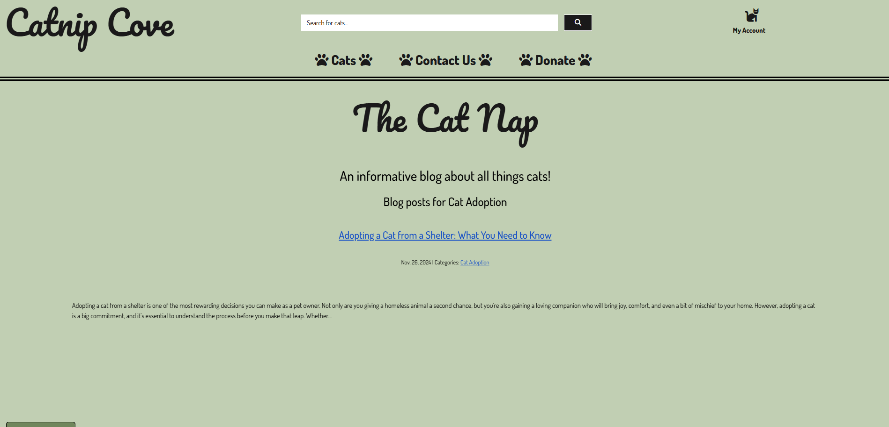
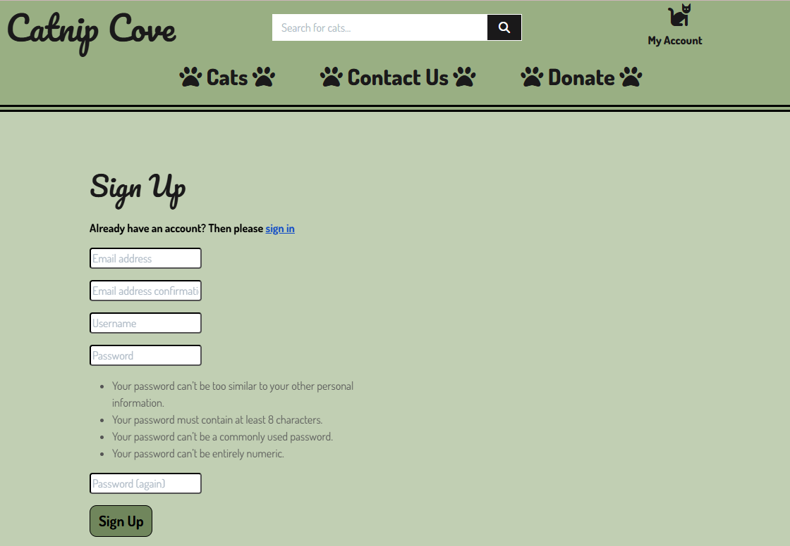
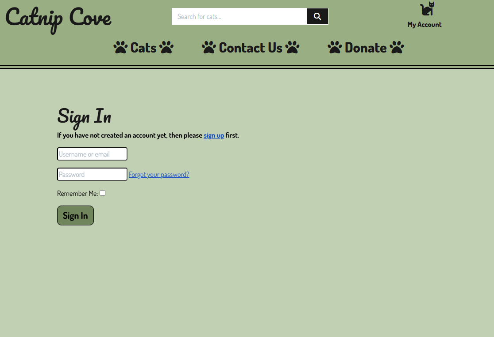

# **Catnip Cove**

**[Link to the Deployed Site]** - [Catnip Cove](https://catnip-cove-8a89db282e0c.herokuapp.com/)

# Project Overview

Catnip Cove is a fictitious cat rescue centre, ecommerce full stack donation project built using Django, Python, JavaScript and Bootstrap. The site is deployed to Heroku, which uses Stripe for payment processing.

Catnip Cove is my 4th milestone project for Code Institute's Level 5 Diploma in Web Application Development (Full Stack Software Development).
 

---

**TABLE OF CONTENTS**
* [USER EXPERIENCE](#user-experience)
    * [Strategy Plane](#strategy-plane)
        * [Project Goals](#project-goals)
    * [Scope Plane](#scope-plane)
        * [Feature Planning](#feature-planning)
        * [User Stories](#user-stories)
    * [Structure Plane](#structure-plane)
        * [User Flow Diagram](#user-flow-diagram)
        * [Database Design](#database-design)
            * [Database ERD](#database-erd)
            * [Data Modelling](#data-modelling)
                * [User Model](#user-model)
                * [UserProfile](#userprofile-model)
                * [Cat Model](#cat-model)
                * [Donation Model](#donation-model)
                * [BlogPost Model](#blogpost-model)
                * [BlogComment Model](#blogcomment-model)
                * [BlogCategory Model](#blogcategory-model)
    * [Skeleton Plane](#skeleton-plane)
        * [Wireframes](#wireframes)
    * [Surface Plane](#surface-plane)
        * [Typography](#typography)
        * [Colour Palette](#colour-palette)
        * [Imagery](#imagery)
* [Features](#features)
    * [Site Features Common to All Pages](#site-features-common-to-all-pages)
    * [Site Pages](#site-pages)
        * [Home Page](#home-page)
        * [Cats Page](#cats-page)
        * [Cat Detail Page](#cat-detail-page)
        * [Contact Us Page](#contact-us-page)
        * [Donation Page](#donation-page)
        * [Donation Success Page](#donation-success-page)
        * [Main Blog Page](#main-blog-page)
        * [Example Blog Article Page](#example-blog-article-page)
        * [Example Blog Category Page](#example-blog-category-page)
        * [Profile Page](#profile-page)
        * [Register Page](#registersign-up-page)
        * [Login Page](#loginsign-in-page)
        * [Log Out Page](#log-outsign-out-page)
        * [Password Rest Page](#password-reset-page)
        * [Cat Management Page (Superuser/Admin Only)](#cat-management-page-superuseradmin-only)
        * [Edit a Cat Page (Superuser/Admin Only)](#edit-a-cat-page-superuseradmin-only)
        * [Blog Management (Superuser/Admin Only)](#blog-management-superuseradmin-only)
        * [Edit a Blog Page (Superuser/Admin Only)](#edit-a-blog-page-superuseradmin-only)
        * [404 & 500 Error Page](#404--500-error-page)
    * [Defensive Programming](#defensive-programming)
    * [Accessibility](#accessibility)
* [Future Development, Iteration and Implementation](#future-development-iteration-and-implementation)
* [Technologies Used](#technologies-used)
    * [Languages Used](#languages-used)
    * [Frameworks Used](#frameworks-used)
    * [Databases Used](#databases-used)
    * [Libraries and Packages Used](#libraries-and-packages-used)
    * [Programmes and Applications Used](#programmes-and-applications-used)
    * [Payment Processing Platform Used](#payment-processing-platform-used)
    * [Cloud Application Platforms Used](#cloud-platforms-used)
    * [Cloud Storage Services Used](#cloud-storage-services-used)
* [Testing](#testing)
* [Bugs, Issues and Solutions](#bugs-issues-and-solutions)
* [Deployment](#deployment)
* [Credits](#credits)
* [Acknowledgements](#acknowledgements)

---

# User Experience

## STRATEGY PLANE

Cat rescue centres are hardworking charities that employ numerous staff, including volunteers and require donations to continue the work that they do. From helping strays to struggling families with household pet cats.
They have even helped people who are in a domestic abuse situation within their living space (according to Cats Protection (https://www.cats.org.uk/mediacentre/facts-figures)), by taking in pets to help and make it easier for the victims to get away from the situation they are in without having to worry about their pets.
They require all the help they can get, from anyone.

Whilst looking for ideas for my donation form, I came across "https://givebutter.com/blog/donation-form-template" which had a quote on the page;   
"Fundraising pro, Lynne Wester, said it best during a recent webinar on nonprofit trends:
“What questions should you ask when someone is making a donation? Less is more. You need my name, but my marital status is none of your business. 
Every click a donor has to make leads to 20% more abandonment. I can buy a live goat on Amazon in one click, but I try to give you $500 and you’re killing me—asking me for my street address? Stop making it hard for me to give you money.”
Though each nonprofit is different, there are a few common elements that are crucial to consider when reviewing a donation form template. We recommend you stick to the basics:

✅ First and last name  
✅ Email address  
✅ Payment information  
✅ Postal code"  

Because of this information, I decided to trim down my original idea for the requested information on the donation form.

## Target Audience

- The target audience for Catnip Cove is anyone who loves cats, who would like to donate to a worthy cause and get a little something in return.

### **Project Goals**

My goal is to design and create a website that allows users to view the current rescue centre cats, donate money to the rescue centre or to a particular cat, to keep track of how much they have donated and to have information about the cats at the rescue and cats in general by way of a blog.

- ### Create a clear, readable and intuitive front end display

  I wanted the point of the website to be easily understood from the home page whilst looking appealing and for the user to be able to easily navigate the website where they can view all the cats and donate money to the rescue/particular cat. I also wanted a superuser (admin) to be easily able to add, edit and delete the records that are on the database.

- ### Make use of available backend functionality & Store data on an external cloud database

  The use of the backend framework allows users to create, edit and delete records of cats/blogs and comments. I used Code Institute's Postgres database server to store the PostgreSQL database for this project.

- ### Make it easy for the user to donate to the rescue centre
  
  The main point of this rescue centre website is to obtain and encourage donations, so I want the donation form quick and easy to navigate to and fill out. I wanted there to be an option to register for the website so that the user can then keep track of all the donations made.
  
- ### Give the user an option and incentive to register
  
  As mentioned above, I wanted to provide an area of the website for people who want to register and keep track of their donations. Any user who is registered, can then access a members only blog, where they can comment on the articles that have been shared by the admin of the website.

## SCOPE PLANE
### **Feature Planning**

When planning for this website, I researched existing websites and found that they were all quite busy and overwhelming. With this in mind, I conducted Desirability, Importance and Viability analysis to determine the features I would like to add and whether they were feasible.

| # | Feature | Target User | Desirability | Importance | Viability  | Delivered |
| --- | --- | --- | --- | --- | --- | --- |
| Users |  |  |  |  |  |  |
| 1 | Admin Access | Superuser/Admin | 5 | 5 | 5 | ✅ |
| 2 | Account Registration | All Users | 5 | 5 | 5 | ✅ |
| 3 | User Verification Email | Registered User | 5 | 5 | 5 | ✅ |
| 4 | Password Reset | Registered Users | 5 | 5 | 5 | ✅ |
| 5 | User Profile Page | Registered Users | 5 | 5 | 5 | ✅ |
| Navigation |  |  |  |  |  |  |
| 6 | Top Navigation to Include: logo, search bar, my account (register, login) and site links | All Users | 5 | 5 | 5 | ✅ |
| 7 | Top Navigation to Include: my account (my profile, logout and members blog) | Logged In Users | 5 | 5 | 5 | ✅ |
| 8 | Top Navigation to Include: my account (cat management, blog management, my profile, logout and members blog) | Logged In Superuser/Admin | 5 | 5 | 5 | ✅ |
| 9 | Top Navigation Search Bar: to be enabled for searching by cat name, breed or colour | All Users | 5 | 5 | 5 | ✅ |
| Cats |  |  |  |  |  |  |
| 10 | Filter Cat Records | All Users | 5 | 5 | 5 | ✅ |
| 11 | Sort Cat Records | All Users | 5 | 5 | 5 | ✅ |
| 12 | Cat details/information | All Users | 5 | 5 | 5 | ✅ |
| 13 | Link to Donate for Specific Cat | All Users | 4 | 5 | 5 | ❌ |
| 14 | Display Counter of Cat Records | All Users | 5 | 5 | 5 | ✅ |
| 15 | Cat Management Frontend | Superuser/Admin | 5 | 5 | 5 | ✅ |
| Contact Us |  |  |  |  |  |  |
| 16 | Contact Form | All Users | 5 | 3 | 5 | ✅ |
| 17 | Email of Contact Form | Superuser/Admin/Owner | 5 | 5 | 5 | ✅ |
| Donate |  |  |  |  |  |  |
| 18 | Email Confirmation of Donation | Donator | 5 | 5 | 5 | ✅ |
| 19 | Donation History | Registered Users | 5 | 5 | 5 | ✅ |
| 20 | Save/update customer details for profile on form submission | Registered Users/Sign Up Users | 5 | 5 | 5 | ✅ |
| 21 | Pre-fill Form From Profile Details | Registered Users |  5 | 3 | 3 | ❌ |
| 22 | Share Donation Via Social Media | All users |  5 | 2 | 2 | ❌ |
| Blog |  |  |  |  |  |  |
| 23 | Articles/Posts - Create, Read, Update and Delete | Superuser/Admin | 5 | 5 | 5 | ✅ |
| 24 | Comments - Read and Delete | Superuser/Admin | 5 | 5 | 5 | ✅ |
| 25 | Comment on Articles | Registered Users | 5 | 5 | 5 | ✅ |

### **User Stories**
| **USER STORY #** | **As a/an** | **I want to be able to...** | **So that I can...** |
| --- | --- | --- | --- |
| **VIEWING & NAVIGATION** |   |   |
| 1 | First Time User | Understand the concept of the website and how to use it | See what the site is about  |
| 2 | First Time User | Go to the cat records & filter/sort them | See the cats at the rescue |
| 3 | First Time User | Contact the rescue centre | Offer to volunteer or ask any questions I may have |
| 4 | First Time User | Easily navigate to any of the other pages, from every page | Go wherever I choose on the website |
| 5 | Donator | Navigate to the correct page to donate | Make a general donation to the rescue |
| 6 | Superuser/Admin | View special pages to adjust the records on the website | Keep records up-to-date and what I want to be on the site |
| **REGISTRATION & USER ACCOUNTS** |   |   |
| 7 | First Time User | Sign up for an account easily | Have a user profile and the perks that come with that |
| 8 | Registered User | Receive an email confirmation of my registration | Confirm my sign up was successful  |
| 9 | Registered User | Easily log in and out of my account | Access my personal information and to be able to logout of my account for security |
| 10 | Registered User | Recover/Change my password | Ensure security of my account or gain access if I forget my password |
| 11 | Registered User | Have a personalised profile | To view my donation history and donation confirmations |
| 12 | Donator | View a list of all the donations I have made already | Keep track of my spending |
| 13 | Superuser/Admin | Gain access from my account to page for creating, reading, editing or deleting the cat records | Keep the website up-to-date |
| **SORTING & SEARCHING** |   |   |
| 14 | First Time User | Sort cats by breed, colour or sex | To find a cat of a particular category |
| 15 | Frequent User | Search for cats by typing their name, colour or breed in the search bar | To find a cat of a particular category |
| 16 | General User | Easily see my search results and the number of records | See how many cats are at the rescue in the breed/colour/sex I typed |
| **DONATING** |   |   |
| 17 | Donator | Make a donation for a particular cat | Make a donation that will be spent on a particular cat |
| 18 | Donator | Make a different donation than any suggested amounts | Pay as much as I want |
| 19 | Donator | Fill in the donation form easily and quickly | Make a donation without too much hassle |
| 20 | Donator | View a donation confirmation after it has processed | Verify everything is correct |
| 21 | Donator | Receive an email confirmation of the donation | To keep records of my spending |
| **BLOG** |   |   |
| 22 | Registered User | View blog articles | Gain information about cats |
| 23 | Registered User | View blog articles in a certain category | View all articles in that category  |
| 24 | Registered User | Make comments on blog articles | Contribute to the community or ask questions |
| 25 | Registered User | Easily navigate back to the initial blog page | Go back and view more articles |
| 26 | Superuser/Admin | Create, read, edit, update and delete blog articles | Have control over the content on the blog |
| 27 | Superuser/Admin | Read and delete inappropriate comments | Have control over the comments on the blog |
| **ADMIN & STORE MANAGEMENT** |   |   |
| 28 | Superuser/Admin | Add, edit or delete a cat | Keep records up-to-date, add new cats to the site and remove cats that are no longer in the rescue centre |
| 29 | Superuser/Admin | Receive a warning when I click the delete button | Avoid accidental deletion of a cat record/blog/comment |

## STRUCTURE PLANE

#### **User Flow Diagram**

  
Click here to view Login/Register User Flow Diagram

  

  
Click here to view General User Flow Diagram

  

  
Click here to view Logged In Superuser Flow Diagram

  

  
Click here to view Logged In User Flow Diagram

  

### **Database Design**
Designing an efficient, useful database is a matter of following the proper process, including these phases:
1. Requirements analysis, or identifying the purpose of the database
2. Organizing data into tables
3. Specifying primary keys and analyzing relationships
4. Normalizing to standardize the tables

Above points obtained from - Source: [Lucidchart Database Design Info](https://www.lucidchart.com/pages/database-diagram/database-design)

How did these phases get implemented in the designing of the database?
1. Requirements Analysis - identifying the purpose of the database
This first phase was completed after carrying out research & brainstorming:
* Visiting other cat rescue websites and seeing what they have to offer.
* Researching ideas to give the user more than just a donation site.
2. Organizing data into tables - determining the database structure
* The planning of the tables, with the visual help of Lucid Chart, was designed on their website using their own app.
* The tables are the visual representation of the data that will be in the database and as the project development progressed, other fields and data types were added and refined.
3. Analysing the relationships between the tables was an important step to identify the cardinality (Cardinality refers to the maximum number of times an instance in one entity can relate to instances of another entity - source: [Lucidchart Database Diagram Symbols & Meaning](https://www.lucidchart.com/pages/ER-diagram-symbols-and-meaning), this basically means how many times one thing can be connected to another thing, in this case, tables.) to ensure that the data has been appropriately allocated and positioned. The relationships between entities were determined whether they are:
    * one-to-one relationships
    * one-to-many relationships
    * many-to-many relationships

    

3. Normalizing to standardize the tables
* As a website that processes donations, Catnip Cove's databases are ideal candidates for normalization as the users (Shop Owners, Superadmins and Shoppers) are concerned with creating, reading, updating and deleting (CRUD) records.
* For normalizing, the tables can only have unique rows and atomic values (no lists or arrays). For instance, a cat cannot have more than one gender/breed etc.

#### **Database ERD**
**Entity Relationship Diagram** 
The below ER diagram shows the relationships between real-world entities identified in my project, for use with the project. I created an initial schema and adjusted it along the way, but by the end of the project there were a couple tweaks to it, so I have included that ERD as well below.

[INITIAL ERD/DATABASE SCHEMA](./documentation/database/catnip-cove-database-erd.png) 
[FINAL ERD/DATABASE SCHEMA](./documentation/database/catnip-cove-database-erd-final.png) 

#### **Data Modelling**
As shown by the database design and the ERD above, the data model type used for this project is the Relational Model. This is basically an organised digital filing system where you store related/connected information in tables made up of rows and columns. You can read more about Relational Databases [here](https://www.oracle.com/uk/database/what-is-a-relational-database/).

##### *User Model*
- The User model is a component of Django's Authentication system and contains information about the user.
- The User model contains the following fields: email, first_name, last_name, password, is_staff, is_active, is_superuser, date_joined, and last_login.

##### *UserProfile Model*
- The UserProfile model is an extension of the Django User model and has a one-to-one relationship with it.
- The UserProfile model contains the following fields: user, default_first_name, default_last_name, default_email_address, default_postcode.
- The UserProfile model is included in the installed profiles application.

##### *Cats Model*
- The Cats model contains the following fields: name, age_if_known, breed, colour, gender, description, image_url, image.
- It is one of the models included in the installed Cats application.
- It is one of three original custom Django models created for the project.

##### *Donation Model*
- The Donation model contains the following fields: donation_number, amount, message, donor_first_name, donor_last_name, donor_email_address, donor_postcode, date, stripe_pid.
- It also contains user_profile and cat as a ForeignKey
- It is one of the models included in the installed donation application.

##### *BlogPost Model*
- The BlogPost model (called Post in application) contains the following fields: title, body, created_on, last_modified, categories, image_url, image.
- It is one of the models included in the installed Blog application.
- It is one of FIVE original custom Django models created for the project.

##### *BlogComment Model*
- The BlogComment model (called Comment in application) contains the following fields: author, body, created_on, post.
- It also contains Post as a ForeignKey.
- It is one of the models included in the installed Blog application.

##### *BlogCategory Model*
- The BlogCategory model (called Category in application) contains the following fields: name, slug.
- It is one of the models included in the installed Blog application.

## **SKELETON PLANE**
### **Wireframes**
Wireframes are a necessary part of the planning process, to help visualise the look of the site, these wireframes were created using [Balsamiq](https://balsamiq.com/).

  
Click here to view Home Page Wireframes

  
  

  
Click here to view Contact Us Wireframes

  
  
  

  
Click here to view Donate Page Wireframes

  
  

  
Click here to view Blog Page Wireframe

  

  
Click here to view Profile Page Wireframes

  
  

## **SURFACE PLANE**
### **Typography**
For the fonts on the website, I decided to go with a slightly fancy font, **'Pacifico'**, for the main navbar text logo and headings. For the rest of the site, I decided to use a plain but clear and smart looking font called **'Dosis'**, this distinguishes the body of the site from the titles and headings and also means it is easy for the user to read.

### **Colour Palette**
To create the colour palette, I used the hero image and picked some colours from that to make the site cohesive and to give it a relevant colour scheme. Using the Colour Contrast Analyser, this showed that the colours were not contrasting enough so I had revise my choices so that the contrast would be good enough to meet the WCAG 2.1 standards. 
 
Below is the final colour palette that has been used throughout the site, please click [HERE](./documentation/branding/old-colour-palette.png) to see my inital colour choices.

### **Imagery**
The hero image was created with the help of AI, using [Deep AI](https://deepai.org/machine-learning-model/text2img), which then inspired the colour palette for the whole site.
All the cat images were obtained using the free image section of [Pexels](https://www.pexels.com/), all of which do not require attribution, but I have credited them in the [credits](#credits) section.

---

## **FEATURES**

This website consists of 19 pages, all of which are extended from a base template.

- Home page
- Cats Page
- Cat Detail Page
- Cat Management/Add Cat (Superuser/Admin only)
- Cat Management/Edit Cat (Superuser/Admin only)
- Contact Us Page
- Donation Page
- Donation Success Page
- Blog Index Page (linking to blog articles)
- Blog Detail Page
- Blog Category Page
- Blog Management/Add Blog (Superuser/Admin only)
- Blog Management/Edit Blog (Superuser/Admin only)
- Profile page
- Register Page
- Login Page
- Logout Page
- 404 Error Page
- 500 Error Page

### **Site Features Common to All Pages**
The below items are used throughout the website.

- Favicon : The website features a picture of a cartoon cat's face as the tab icon, on every page.
 
Created at [Favicon](https://favicon.io/) Example - 

- Navbar : The navbar has two parts; the top navigation and the main navigation links. The first component is the top navigation; this shows the site's clickable text logo (directs to the home page), visitors can also search for cats using the search bar, and sign up or login through the My Account icon dropdown menu.
 
 
The second component is the main navigation links that allow visitors to browse through the cats at the rescue, go to a contact form, and the donation form. The navbar and all its components are fully responsive, as shown below.

* **Top Navigation**
    * Catnip Cove Text Logo
    * Search bar
    * My account (login, register)
        * for logged in Superuser:
            * Cat management
            * My profile
            * Logout
        * For general logged in users (no superadmin permissions):
            * My profile
            * Logout
            * Blog

 

 
 

* **Main Navigation**
    * Catnip Cove Text Logo
        * Links back to the home page
    * Cats Dropdown
        * View cats by all cats, male cats, and female cats
    * Contact Us Link
        * Directs to contact form
    * Donate Link
        * Directs to donation form
    * My Account Dropdown
        * Not logged in:
            * Register, login
        * Logged in:
            * My profile, members blog, logout
        * Logged in superuser/admin:
            * Cat management, my profile, members blog, logout

    Main Navigation screenshots 
    1. Main Navigation - Cat Dropdown Menu Desktop
    * 
    3. Main Navigation - Cat Menu Dropdown Menu Mobile
    * 
    4. Main Navigation - My Account Dropdown Menu Desktop
    * 
    5. Main Navigation - My Account Dropdown Menu Mobile
    *  - This menu is obscured at the right side of the page and mentioned in **KNOWN BUGS** within TESTING.md

- Responsive across all devices, using Bootstrap and Flexbox.
  

 
 

- User feedback with lighter colour on all buttons to show when they are hovered over.
 

 
 
- Main nav links and account link also have a different feedback colour when hovered over.
 

 
 
- The Cats page link and the my account link has a dropdown which features a different colour for feedback to the user to indicate what they are hovering over. 
 

 

 
 
- There is a counter on the cat pages to indicate how many records there are - this updates when the filtering system is used.
 

 
 
- The filtering buttons on the cats page also have a different colour for hovering over and current view to provide more user feedback.
 

 
 

## **Site Pages**

## Home Page
Catnip Cove's home page features the following:

- Top and Main Nav (including search bar, 'My Account' dropdown menu and main nav links; 'Cats', 'Contact Us' and 'Donate')
- Hero image of cat in a greenhouse for a cozy vibe
- Introduction header and text about the rescue centre
- Meet the cats button to take user directly to the cat records

 

## Cats Page
Catnip Cove's Cat pages feature the following:

- Top and Main Nav (including search bar, 'My Account' dropdown menu and main nav links; 'Cats', 'Contact Us' and 'Donate')
- Plain overlay to avoid the page being too 'busy'
- Button bar to filter the records below, filter by; Breed, Colour, Male or Female Cats
- Clickable cat picture/record
- Back to the top button

 

## Cat Detail Page
Catnip Cove's Cat Detail pages feature the following:

- Top and Main Nav (including search bar, 'My Account' dropdown menu and main nav links; 'Cats', 'Contact Us' and 'Donate')
- Plain overlay to avoid the page being too 'busy'
- Card to display all information about cat
- Clickable cat picture/record
- Link for donating against this cat
- Link for editing cat record (Superuser/Admin only)
- Link for deleting cat record (Superuser/Admin only)

 

## Contact Us Page
Catnip Cove's Contact Us page features the following:

- Top and Main Nav (including search bar, 'My Account' dropdown menu and main nav links; 'Cats', 'Contact Us' and 'Donate')
- Hero image of cat in a greenhouse for a cozy vibe'
- Form to send a message to the rescue

 

## Donation Page
Catnip Cove's Donation page features the following:

- Top and Main Nav (including search bar, 'My Account' dropdown menu and main nav links; 'Cats', 'Contact Us' and 'Donate')
- Plain overlay to avoid the page being too 'busy'
- Donation Form with card capture elements

 

## Donation Success Page
Catnip Cove's Donation success page features the following:

- Top and Main Nav (including search bar, 'My Account' dropdown menu and main nav links; 'Cats', 'Contact Us' and 'Donate')
- Plain overlay to avoid the page being too 'busy'
- Thank you messages, detailing donators name, email and amount they have donated
- Button to go back to the donation page

 

## Main Blog Page
Catnip Cove's Blog index page features the following:

- Top and Main Nav (including search bar, 'My Account' dropdown menu and main nav links; 'Cats', 'Contact Us' and 'Donate')
- Plain overlay to avoid the page being too 'busy'
- List of blogs, with title, date created, clickable category link and snippet of blog post text

 

## Example Blog Article Page
Catnip Cove's Blog Article page features the following:

- Top and Main Nav (including search bar, 'My Account' dropdown menu and main nav links; 'Cats', 'Contact Us' and 'Donate')
- Plain overlay to avoid the page being too 'busy'
- Blog title with picture if applicable with date created and clickable category link, and main blog content below
- Comments section at the bottom to view and add comments
- Button to take user back to the blog index page

 

## Example Blog Category Page
Catnip Cove's Blog Category page features the following:

- Top and Main Nav (including search bar, 'My Account' dropdown menu and main nav links; 'Cats', 'Contact Us' and 'Donate')
- Plain overlay to avoid the page being too 'busy'
- Sub headings to show user is on a specific category
- List of blogs within the category
- Button to take user back to the index page

 

## Profile page
Catnip Cove's Profile page features the following:

- Top and Main Nav (including search bar, 'My Account' dropdown menu and main nav links; 'Cats', 'Contact Us' and 'Donate')
- Plain overlay to avoid the page being too 'busy'
- Header and welcome message to user
- Form to update personal detail record
- History of donations made

 

## Register/Sign Up Page
Catnip Cove's Register page features the following:

- Top and Main Nav (including search bar, 'My Account' dropdown menu and main nav links; 'Cats', 'Contact Us' and 'Donate')
- Plain overlay to avoid the page being too 'busy'
- Header and message to user, displaying link to sign in if they already have an account
- Registration form

 

## Login/Sign In Page
Catnip Cove's login page features the following:

- Top and Main Nav (including search bar, 'My Account' dropdown menu and main nav links; 'Cats', 'Contact Us' and 'Donate')
- Plain overlay to avoid the page being too 'busy'
- Header and message to user, displaying link to sign up if they do not have an account
- Username and password inputs
- Remember me check box

 

## Log Out/Sign Out Page
Catnip Cove's log out page features the following:

- Top and Main Nav (including search bar, 'My Account' dropdown menu and main nav links; 'Cats', 'Contact Us' and 'Donate')
- Plain overlay to avoid the page being too 'busy'
- Header and message to user, asking to confirm they wish to log out
- Button to complete sign out

 

## Password Reset Page
Catnip Cove's password reset page features the following:

- Top and Main Nav (including search bar, 'My Account' dropdown menu and main nav links; 'Cats', 'Contact Us' and 'Donate')
- Plain overlay to avoid the page being too 'busy'
- Header and message to user, asking if they've forgotten their password, how to reset it and contact if any problems
- Input element for entering email address to obtain reset link
- Button to reset password

 

## Cat Management (Superuser/Admin only)
Catnip Cove's Cat Management page features the following:

- Top and Main Nav (including search bar, 'My Account' dropdown menu and main nav links; 'Cats', 'Contact Us' and 'Donate')
- Plain overlay to avoid the page being too 'busy'
- Header
- Form to add a cat record

### Edit a Cat Page (Superuser/Admin only)
Catnip Cove's Edit a Cat Record page features the following:

- Top and Main Nav (including search bar, 'My Account' dropdown menu and main nav links; 'Cats', 'Contact Us' and 'Donate')
- Plain overlay to avoid the page being too 'busy'
- Header
- Form with pre-filled information to update a cat record and see current picture

Bottom of form screenshot below as top looks similar to the above

## Blog Management (Superuser/Admin only)
Catnip Cove's Blog Management page features the following:

- Top and Main Nav (including search bar, 'My Account' dropdown menu and main nav links; 'Cats', 'Contact Us' and 'Donate')
- Plain overlay to avoid the page being too 'busy'
- Header
- Form to add a blog record

(Bottom of form is the same as the Cat Management form)

### Edit a Blog Page (Superuser/Admin only)
Catnip Cove's Edit a Blog Article page features the following:

- Top and Main Nav (including search bar, 'My Account' dropdown menu and main nav links; 'Cats', 'Contact Us' and 'Donate')
- Plain overlay to avoid the page being too 'busy'
- Header
- Form with pre-filled information to update a blog article record and see current picture (if applicable)
- Category selection for blog article or creation of new category

 

## 404 & 500 Error Page
The error pages on the site include custom pages for a 404 and 500 Error, they are both the same, just the error message has been changed appropriately.

 

## **Defensive Programming**
To keep the site secure and protected against a brute force attack or attempts to access pages reserved solely based on user permission levels, defensive programming was at the forefront of the development.

* Added "from django.contrib.auth.decorators import login_required" & inserted @login_required above the corresponding view to ensure the user has to log in and will be directed to the log in page if the user tries to access the urls manually.
* Implemented rendering of certain elements on certain templates and menu's only if user is authenticated and/or is a superuser.
* On certain views.py files, I wrote code to check if the user is authenticated and/or is a superuser.
* Meaningful feedback to the user in the form of toast messages, covering success, errors, alerts and warnings

Defensive programming has also been written to handle bad user inputs or actions and their unintended consequences. For example, the use of modals to confirm the intent of deleting a cat record/blog/comment to avoid the unintended deletion of data.

 

[Toast Example](./documentation/features/toast-example.png)

## **Accessibility**
To ensure that Catnip Cove will be as easy for everyone to access and view, I ensure that the site is accessible by:
* Checking accessibility with the WAVE chrome extension
* using Semantic HTML
* using descriptive alt attributes on images used on the site
* Ensuring that there is a sufficient colour contrast throughout the site.
* Optimising images for the website by reducing the file and image size.

---

# **Future Development, Iteration and Implementation**
| **FOR FUTURE IMPLEMENTATION** - I WOULD HAVE LIKED TO... |   |
| --- | --- |
| 1 | Add a feature to sort the cats by age but due to the information I wanted to provide and how I wanted to provide it (age in months as well as whole numbers), the process was too long to research and complete within the timeframe I had |
| 2 | Have a drop down for set donation amounts and a custom donation box for users to specify their donation amount but when trying to complete the webhooks, it presented complications on where to obtain the donation amount, which I do not have the skills for so this was removed from the donation form, model and view |
| 3 | Following on from the above point, I would have liked to include extra validation to ensure the user can only type in values that increment in £0.50, due to time constraints, this could not be looked into and implemented. |
| 4 | Add functionality for donations for a specific cat - due to lack of time this could not be completed |
| 5 | Add functionality so that if the user donates for a specific cat, they get an update within their Profile about the cat and their progress. Also, I would have liked to add a profile photo and birthdate to user profile and trigger an event on the users birthday - due to lack of skills and time this could not be completed |
| 6 | Add social media registration and login functionality |
| 7 | Pre-populate the donation form for a logged in user, with their profile information, but from the Boutique Ado tutorial, I couldn't work out how to make it work for my page |
| 8 | Add email subscription and email marketing |
| 9 | Add a digital gift card product |
| 10 | For better SEO, investigate further / fix the urls to use slug with dash and not id and not underscores |
| 11 | Add more content to the blog pages |
| 12 | Focus more on the aesthetic appearance of the website |
| 13 | Provide a rich text editor to the blog management form as it currently requires the user to use HTML tags when adding a blog to apply formatting and layout styling - The user wouldn't necessarily know HTML either so this could be done incorrectly. |

---
# **TECHNOLOGIES USED**
## **Languages Used**
* [HTML5](https://en.wikipedia.org/wiki/HTML5) was used for the content and structure of the site.
* [CSS3](https://en.wikipedia.org/wiki/CSS#CSS_3) was used for the styling of the site.
* [JavaScript](https://en.wikipedia.org/wiki/JavaScript) was used for the interactivity of the site.
* [Python](https://www.python.org/) was used for the back end programming of the site.

## Frameworks Used
* [DJANGO - v4.2](https://docs.djangoproject.com/en/4.2/releases/4.2/) Django is a free and open-source, Python-based web  framework that follows the model–template–views architectural pattern.
* [Bootstrap5](https://getbootstrap.com/docs/5.3/getting-started/introduction/) was used as the frontend framework.

## Databases Used
* [DB.SQLITE3](https://docs.djangoproject.com/en/4.1/ref/databases/#sqlite-notes) was the database used for the project (development).
* [PostgreSQL](https://www.postgresql.org/) PostgreSQL Database Server was used to store PostgreSQL database (production).

## **Libraries and Packages Used**
* [Django-allauth](https://django-allauth.readthedocs.io/en/latest/) is an integrated set of Django applications dealing with account authentication, registration, management, and third-party (social) account authentication.
* [JQuery - v3.4.1](https://jquery.com/) is a fast, small, and feature-rich JavaScript library.
* [Font Awesome Kit](https://fontawesome.com/v5/docs/web/setup/use-kit) is used for its icon toolkit.
* [Django-crispy-forms, v2.3](https://pypi.org/project/django-crispy-forms/) was used to build programmatic reusable layouts out of form components.
* [Gunicorn](https://gunicorn.org/) - a Python WSGI HTTP Server that allows us to run any Python application concurrently by running multiple processes within a single dyno
* [Pillow](https://pypi.org/project/Pillow/) - a required Python imaging library used to enable handling of images.
* [Psycopg2](https://pypi.org/project/psycopg2/) - a postgresql database adapter for python and used to connect with our postgres database
* [Boto3==1.35.82](https://pypi.org/project/boto3/), [Botocore==1.35.82] is an Amazon Web Services (AWS) software development kit (SDK) used to connect to the S3 bucket
* [Pip](https://pip.pypa.io/en/stable/) is the package installer for Python, allowing us to install the packages we need for this site.
* [Django storages](https://django-storages.readthedocs.io/en/latest/) - collection of custom storage backends for Django
* [Google Fonts](https://fonts.google.com/) Used to import the fonts Pacifico & Dosis, which have been used on all pages within the project.

## **Programmes and Applications Used**
* [Lucid Chart](https://www.lucidchart.com/pages/) was used to draw and build the Entity Relationship Diagram. It was also used to draw the User Flow Diagram.
* [favicon.io](https://favicon.io/) used to create the site's favicon.
* [Git](https://git-scm.com/) The git command was used for version control via the terminal in Gitpod, to commit to Git and Push to GitHub.
* [GitHub](https://github.com/) is the project's git repository.
* [Chrome DevTools](https://www.google.com/intl/en_uk/chrome/) - used for debugging and validation (Lighthouse).
* [PEP8 Validator](https://pep8ci.herokuapp.com/) Used to check python code for errors.
* [Am I Responsive?](https://ui.dev/amiresponsive) To show the website image on a range of devices.
* [Balsamiq](https://balsamiq.com/) Balsamiq was used to create wireframes.

## **Payment Processing Platform Used**
* [Stripe](https://stripe.com/gb) was used to test and implement the payment processing for the site.

## **Cloud Application Platforms Used**
* [Heroku](https://devcenter.heroku.com/) was used for hosting and deployment of the live site. I have ensured the version being deployed to Heroku matches the development version by checking features and screen layouts on both versions.

## **Cloud Storage Services Used**
* [AWS S3](https://aws.amazon.com/) was used to store the images and static files.
---

# **TESTING**
Please refer to [TESTING.md](./TESTING.md) file for:
* Automated Testing and Validation Results
* Manual Testing and Results

 

---
# **BUGS, ISSUES AND SOLUTIONS**
Please also refer to [TESTING.md](./TESTING.md) file for:
* Solutions to bugs found during testing and development phase
* Known bugs
 

---
# **DEPLOYMENT**
Please refer to [DEPLOYMENT.md](./DEPLOYMENT.md) file for:
* Creating the database to be used in production
* Deploying to Heroku
* Setting up AmazonS3 for hosting our static and media files
---

# **CREDITS**
## **Code**
* Credit to [Code Institute's](https://codeinstitute.net/) Boutique Ado walkthrough, from which this project is based on.
* Credit to Sarah from Code Institute, who provided me with her [Animal House Project](https://github.com/SJECollins/animalhousedjango/tree/main) due to struggling with getting webhooks to work. I have also used and adjusted her code for the donation confirmation emails from this project.
* To create the blog part of the project, I followed these [tutorials](https://realpython.com/build-a-blog-from-scratch-django/#add-the-blog-app-that-youll-build-from-scratch) and also [this](https://www.youtube.com/watch?v=m3hhLE1KR5Q) tutorial.
* Used the Stripe [Documentation](https://docs.stripe.com/api/customers/create) to learn about creating customers for future use, to track donations etc.
* I didn't want the user to be able to type a number less than 1 in the donation amount input box, whilst using Sarah from Code Institutes Code, I found "validators=[MinValueValidator(0.50)]" in her model, which I looked into briefly and found I could change it to suit my input by changing to "1".
* STRIPE DONATION PAGE - Used tutorial (https://www.youtube.com/watch?v=oZwyA9lUwRk)
* I wanted to be able to view the donation records in the admin but I did not want them to be editable as there is no need to. I found this [tutorial](https://stackoverflow.com/questions/48067882/django-admin-making-a-required-field-read-only) to help me understand the subject further. This is also in the Boutique Ado tutorial, but is not explained at length.

## **Media**
* The hero image 'banner-cat' was created using DeepAI image generator.
* All other images used on the cats page and also on the blog pages, came from Pexels.com which do not require attribution but I would like to list the names of the users below.
    - Burak Argun, Mathias Reding, Omar Ramadan, Bogdan Groshev, Nika Benedictova, Ольга Макарова, cottonbro studio, Maria Luiza Melo, Samet Dikmen, Dan Galvani Sommavilla, Faheem Ahamad, Nadiye Odabaşı, Doğan Furkan Yeşilırmak, Mateusz Walendzik, Burak Kağan Güneş, FURKAN, Leticia  Curvelo, Gökhan Yetimova, Sarkhan Asgarli, Cats Coming & Thirdman.

---

# **ACKNOWLEDGEMENTS**
I would like to acknowledge the following people for helping me to complete this project:
* Sarah and Rebecca @ Student Support - who gave me the most help when dealing with stripe and webhooks issues! These two are legends; Sarah gave me her project to help with the webhook and handler issues - https://github.com/SJECollins/animalhousedjango/tree/main which I adapted and tweaked to work within my own project.
* My spouse who has provided me with great support at home while creating this project and throughout this course.
* My College Tutor, Rachel Furlong for always being so helpful and providing great guidance.

# *Copyrights*
 (An e-commerce Full Stack Developer Project for educational purposes only)