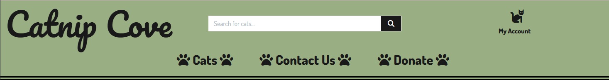
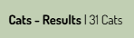
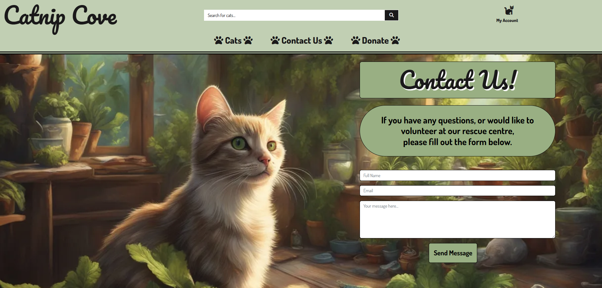
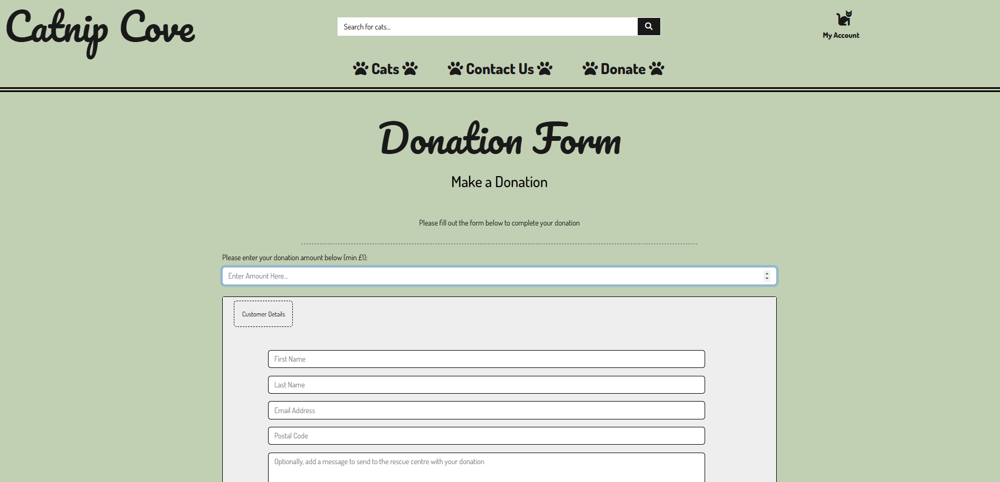
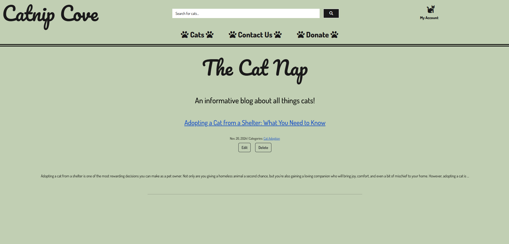
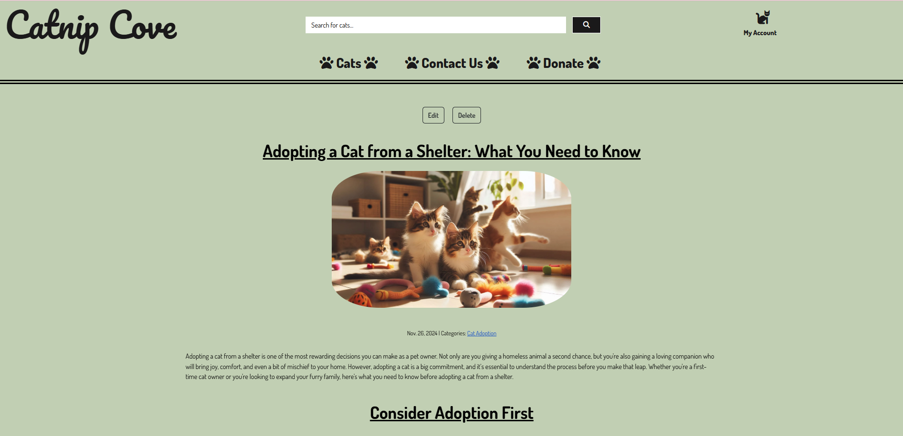

# **Catnip Cove**

![amiresponsive mock-ups of Catnip Cove]

**[Link to the Deployed Site]**

![GitHub last commit]
![GitHub language count]
![GitHub top language] - go to shields.io

# Project Overview

Catnip Cove is a fictitious cat rescue centre, ecommerce full stack donation project built using Django, Python, JavaScript and Bootstrap. The site is deployed to Heroku, which uses Stripe for payment processing.

Catnip Cove is my 4th milestone project for Code Institute's Level 5 Diploma in Web Application Development (Full Stack Software Development).
 

---

**TABLE OF CONTENTS**
* [USER EXPERIENCE](#user-experience)
    * [Strategy Plane](#strategy-plane)
        * [Project Goals](#project-goals)
    * [Scope Plane](#scope-plane)
        * [Feature Planning](#feature-planning)
        * [Content Requirement Planning](#content-requirement-planning)
        * [User Stories](#user-stories)
    * [Structure Plane](#structure-plane)
        * [User Flow Diagram](#user-flow-diagram)
            * [Site Map](#site-map)
        * [Database Design](#database-design)
            * [Database ERD](#database-erd)
            * [Data Modelling](#data-modelling)
                * [User Model](#user-model)
                * [UserProfile](#userprofile-model)
                * [Cat Model](#cat-model)
                * [Donation Model](#donation-model)
                * [BlogPost Model](#blogpost-model)
                * [BlogComment Model](#blogcomment-model)
                * [BlogCategory Model](#blogcategory-model)
    * [Skeleton Plane](#skeleton-plane)
        * [Wireframes](#wireframes)
    * [Surface Plane](#surface-plane)
        * [Typography](#typography)
        * [Colour Palette](#colour-palette)
        * [Imagery](#imagery)
* [Features](#features)
    * [Site Features Common to All Pages](#site-features-common-to-all-pages)
    * [Site Pages](#site-pages)
        * [Home Page](#home-page)
        * [Cats Page](#cats-page)
        * [Contact Us Page](#contact-us-page)
        * [Main Blog Page](#main-blog-page)
        * [Example Blog Article Page](#example-blog-article-page)
        * [Example Blog Category Page](#example-blog-category-page)
        * [Profile Page](#profile-page)
        * [Cat Management Page (Superuser/Admin Only)](#cat-management-page-superuseradmin-only)
        * [404 Error Page](#404-error-page)
    * [Defensive Programming](#defensive-programming)
    * [Accessibility](#accessibility)
* [Future Development, Iteration and Implementation](#future-development-iteration-and-implementation)
* [Technologies Used](#technologies-used)
    * [Languages Used](#languages-used)
    * [Frameworks Used](#frameworks-used)
    * [Databases Used](#databases-used)
    * [Libraries and Packages Used](#libraries-and-packages-used)
    * [Programmes and Applications Used](#programmes-and-applications-used)
    * [Payment Processing Platform Used](#payment-processing-platform-used)
    * [Cloud Application Platforms Used](#cloud-platforms-used)
    * [Cloud Storage Services Used](#cloud-storage-services-used)
* [Testing](#testing)
* [Bugs, Issues and Solutions](#bugs-issues-and-solutions)
* [Deployment and Local Development](#deployment-and-local-development)
    * [Deployment](#deployment)
    * [Local Development](#local-development)
        * [How to Fork](#how-to-fork)
        * [How to Clone](#how-to-clone)
* [Credits](#credits)
* [Acknowledgements](#acknowledgements)

---

# User Experience

## STRATEGY PLANE

Cat rescue centres are hardworking charities that employ numerous staff, including volunteers and require donations to continue the work that they do. From helping strays to struggling families with household pet cats.
They have even helped people who are in a domestic abuse situation within their living space (according to Cats Protection (https://www.cats.org.uk/mediacentre/facts-figures)), by taking in pets to help and make it easier for the victims to get away from the situation they are in without worrying about their pets.
They require all the help they can get, from anyone.

## Target Audience

- The target audience for Catnip Cove is anyone who loves cats, who would like to donate to a worthy cause and get a little something in return.

### **Project Goals**

My goal is to design and create a website that allows users to view the current rescue centre cats, donate money to the rescue centre or to a particular cat, to keep track of how much they have donated and to have information about the cats at the rescue and cats in general by way of a blog.

- ### Create a clear, readable and intuitive front end display

  I wanted the point of the website to be easily understood from the home page whilst looking appealing and for the user to be able to easily navigate the website where they can view all the cats and donate money to the rescue/particular cat. I also wanted a superuser (admin) to be easily able to add, edit and delete the records that are on the database.

- ### Make use of available backend functionality & Store data on an external cloud database

  The use of the backend framework allows users to create, edit and delete records of cats/blogs and comments. I used Code Institute's Postgres database server to store the PostgreSQL database for this project.

- ### Make it easy for the user to donate to the rescue centre
  
  The main point of this rescue centre website is to obtain and encourage donations, so I want the donation form quick and easy to navigate to and fill out. I wanted there to be an option to register for the website so that the user can then keep track of all the donations made.
  
- ### Give the user an option and incentive to register
  
  As mentioned above, I wanted to provide an area of the website for people who want to register and keep track of their donations. Any user who is registered, can then access a members only blog, where they can comment on the articles that have been shared by the admin of the website.

## SCOPE PLANE
### **Feature Planning**

When planning for this website, I researched existing websites and found that they were all quite busy and overwhelming. With this in mind, I conducted Desirability, Importance and Viability analysis to determine the features I would like to add and whether they were feasible.

| # | Feature | Target User | Desirability | Importance | Viability  | Delivered |
| --- | --- | --- | --- | --- | --- | --- |
| Users |  |  |  |  |  |  |
| 1 | Admin Access | Superuser/Admin | 5 | 5 | 5 | ✅ |
| 2 | Account Registration | All Users | 5 | 5 | 5 | ✅ |
| 3 | User Email Confirmation | Registered User | 5 | 5 | 5 | ✅ |
| 4 | Password Change/Reset | Registered Users | 5 | 5 | 5 | ✅ |
| 5 | User Profile Page | Registered Users | 5 | 5 | 5 | ✅ |
| Navigation |  |  |  |  |  |  |
| 6 | Top Navigation to Include: logo, search bar, my account (register, login) and site links | All Users | 5 | 5 | 5 | ✅ |
| 7 | Top Navigation to Include: my account (my profile, logout), and members blog | Logged In Users | 5 | 5 | 5 | ✅ |
| 8 | Top Navigation to Include: my account (cat management, my profile, logout) and members blog | Logged In Superuser/Admin | 5 | 5 | 5 | ✅ |
| 9 | Top Navigation Search Bar: to be enabled for searching by cat name, breed or colour | All Users | 5 | 5 | 5 | ✅ |
| Cats |  |  |  |  |  |  |
| 10 | Filter Cat Records | All Users | 5 | 5 | 5 | ✅ |
| 11 | Sort Cat Records | All Users | 5 | 5 | 5 | ✅ |
| 12 | Cat details/information | All Users | 5 | 5 | 5 | ✅ |
| 13 | Link to Donate for Specific Cat | All Users | 4 | 5 | 5 | ✅ |
| 14 | Display Counter of Cat Records | All Users | 5 | 5 | 5 | ✅ |
| 15 | Cat Management Frontend | Superuser/Admin | 5 | 5 | 5 | ✅ |
| Contact Us |  |  |  |  |  |  |
| 16 | Contact Form | All Users | 5 | 3 | 5 | ✅ |
| 17 | Email of Contact Details Sent | Superuser/Admin/Owner | 5 | 5 | 5 | ✅ |
| Donate |  |  |  |  |  |  |
| 18 | Email Confirmation of Donation | Donator | 5 | 5 | 5 | ✅ |
| 19 | Donation History | Registered Users | 5 | 5 | 5 | ✅ |
| 20 | Save/ Update Customer Details on form submission | Registered Users/Sign Up Users | 5 | 5 | 5 | ✅ |
| 21 | Pre-fill Form From Profile Details | Registered Users |  5 | 3 | 3 | ✅ |
| 22 | Share Donation Via Social Media | All users |  5 | 2 | 2 | ❌ |
| Blog |  |  |  |  |  |  |
| 23 | Articles - Create, Read, Update and Delete | Superuser/Admin | 5 | 5 | 5 | ✅ |
| 24 | Comments - Read and Delete | Superuser/Admin | 5 | 5 | 5 | ✅ |
| 25 | Comment on Articles | Registered Users | 5 | 5 | 5 | ✅ |

### **User Stories**
| **USER STORY #** | **As a/an** | **I want to be able to...** | **So that I can...** |
| --- | --- | --- | --- |
| **VIEWING & NAVIGATION** |   |   |
| 1 | First Time User | Understand the concept of the website and how to use it | See what the site is about  |
| 2 | First Time User | Go to the cat records & filter/sort them | See the cats at the rescue |
| 3 | First Time User | Contact the rescue centre | Offer to volunteer or ask any questions I may have |
| 4 | First Time User | Easily navigate to any of the other pages, from every page | Go wherever I choose on the website |
| 5 | Donator | Navigate to the correct page to donate | Make a general donation to the rescue |
| 6 | Superuser/Admin | View special pages to adjust the records on the website | Keep records up-to-date and what I want to be on the site |
| **REGISTRATION & USER ACCOUNTS** |   |   |
| 7 | First Time User | Sign up for an account easily | Have a user profile and the perks that come with that |
| 8 | Registered User | Receive an email confirmation of my registration | Confirm my sign up was successful  |
| 9 | Registered User | Easily log in and out of my account | Access my personal information and to be able to logout of my account for security |
| 10 | Registered User | Recover/Change my password | Ensure security of my account or gain access if I forget my password |
| 11 | Registered User | Have a personalised profile | To view my donation history and donation confirmations |
| 12 | Donator | View a list of all the donations I have made already | Keep track of my spending |
| 13 | Superuser/Admin | Gain access from my account to page for creating, reading, editing or deleting the cat records | Keep the website up-to-date |
| **SORTING & SEARCHING** |   |   |
| 14 | First Time User | Sort cats by breed, colour or sex | To find a cat of a particular category |
| 15 | Frequent User | Search for cats by typing their name, colour or breed in the search bar | To find a cat of a particular category |
| 16 | General User | Easily see my search results and the number of records | See how many cats are at the rescue in the breed/colour/sex I typed |
| **DONATING** |   |   |
| 17 | Donator | Make a donation for a particular cat | Make a donation that will be spent on a particular cat |
| 18 | Donator | Make a different donation than any suggested amounts | Pay as much as I want |
| 19 | Donator | Fill in the donation form easily and quickly | Make a donation without too much hassle |
| 20 | Donator | View a donation confirmation after it has processed | Verify everything is correct |
| 21 | Donator | Receive an email confirmation of the donation | To keep records of my spending |
| **BLOG** |   |   |
| 22 | Registered User | View blog articles | Gain information about cats |
| 23 | Registered User | View blog articles in a certain category | View all articles in that category  |
| 24 | Registered User | Make comments on blog articles | Contribute to the community or ask questions |
| 25 | Registered User | Easily navigate back to the initial blog page | Go back and view more articles |
| 26 | Superuser/Admin | Create, read, edit, update and delete blog articles | Have control over the content on the blog |
| 27 | Superuser/Admin | Read and delete inappropriate comments | Have control over the comments on the blog |
| **ADMIN & STORE MANAGEMENT** |   |   |
| 28 | Superuser/Admin | Add, edit or delete a cat | Keep records up-to-date, add new cats to the site and remove cats that are no longer in the rescue centre |
| 29 | Superuser/Admin | Receive a warning when I click the delete button | Avoid accidental deletion of a cat record/blog/comment |

## STRUCTURE PLANE

#### **User Flow Diagram**
![Catnip Cove User Flow Diagram: logged in superuser, logged in user, and anonymous donator]

### **Database Design**
Designing an efficient, useful database is a matter of following the proper process, including these phases:
1. Requirements analysis, or identifying the purpose of the database
2. Organizing data into tables
3. Specifying primary keys and analyzing relationships
4. Normalizing to standardize the tables

Above points obtained from - Source: [Lucidchart Database Design Info](https://www.lucidchart.com/pages/database-diagram/database-design)

How did these phases get implemented in the designing of the database?
1. Requirements Analysis - identifying the purpose of the database
This first phase was completed after carrying out research & brainstorming:
* Visiting other cat rescue websites and seeing what they have to offer.
* Researching ideas to give the user more than just a donation site.
2. Organizing data into tables - determining the database structure
* The planning of the tables, with the visual help of Lucid Chart, was designed on their website using their own app.
* The tables are the visual representation of the data that will be in the database and as the project development progressed, other fields and data types were added and refined.
3. Analysing the relationships between the tables was an important step to identify the cardinality (Cardinality refers to the maximum number of times an instance in one entity can relate to instances of another entity - source: [Lucidchart Database Diagram Symbols & Meaning](https://www.lucidchart.com/pages/ER-diagram-symbols-and-meaning), this basically means how many times one thing can be connected to another thing, in this case, tables.) to ensure that the data has been appropriately allocated and positioned. The relationships between entities were determined whether they are:
    * one-to-one relationships
    * one-to-many relationships
    * many-to-many relationships

    

3. Normalizing to standardize the tables
* As a website that processes donations, Catnip Cove's databases are ideal candidates for normalization as the users (Shop Owners, Superadmins and Shoppers) are concerned with creating, reading, updating and deleting (CRUD) records.
* For normalizing, the tables can only have unique rows and atomic values (no lists or arrays). For instance, a cat cannot have more than one gender/breed etc.

#### **Database ERD**
**Entity Relationship Diagram** 
The below ER diagram shows the relationships between real-world entities identified in my project, for use with the project.

Initial ERD: [ERD/DATABASE SCHEMA](./documentation/database/catnip-cove-database-erd.png) 

#### **Data Modelling**
As shown by the database design and the ERD above, the data model type used for this project is the Relational Model. This is basically an organised digital filing system where you store related/connected information in tables made up of rows and columns. You can read more about Relational Databases [here](https://www.oracle.com/uk/database/what-is-a-relational-database/).

##### *User Model*
- The User model is a component of Django's Authentication system and contains information about the user.
- The User model contains the following fields: email, first_name, last_name, password, is_staff, is_active, is_superuser, date_joined, and last_login.

##### *UserProfile Model*
- The UserProfile model is an extension of the Django User model and has a one-to-one relationship with it.
- The UserProfile model contains the following fields: user, default_first_name, default_last_name, default_email_address, default_postcode.
- The UserProfile model is included in the installed profiles application.

##### *Cats Model*
- The Cats model contains the following fields: name, age_if_known, breed, colour, gender, description, image_url, image.
- It is one of the models included in the installed Cats application.
- It is one of three original custom Django models created for the project.

##### *Donation Model*
- The Donation model contains the following fields: donation_number, amount, custom_amount, donor_first_name, donor_last_name, donor_email_address, donor_postcode, date, stripe_pid.
- It also contains user_profile and cat as a ForeignKey
- It is one of the models included in the installed donation application.

##### *BlogPost Model*
- The BlogPost model (called Post in application) contains the following fields: slug, title, body, created_on, last_modified, categories, image_url, image.
- It is one of the models included in the installed Blog application.
- It is one of FIVE original custom Django models created for the project.

##### *BlogComment Model*
- The BlogComment model (called Comment in application) contains the following fields: author, body, created_on.
- It also contains Post as a ForeignKey.
- It is one of the models included in the installed Blog application.

##### *BlogCategory Model*
- The BlogCategory model (called Category in application) contains the following fields: name, slug.
- It is one of the models included in the installed Blog application.

## **SKELETON PLANE**
### **Wireframes**
Wireframes are a necessary part of the planning process, to help visualise the look of the site, these wireframes were created using [Balsamiq](https://balsamiq.com/).

  
Click here to view Home Page Wireframes

  
  

  
Click here to view Contact Us Wireframes

  
  
  

  
Click here to view Donate Page Wireframes

  
  

  
Click here to view Blog Page Wireframe

  

  
Click here to view Profile Page Wireframes

  
  

## **SURFACE PLANE**
### **Typography**
For the fonts on the website, I decided to go with a slightly fancy font, **'Pacifico'**, for the main navbar text logo and headings. For the rest of the site, I decided to use a plain but clear and smart looking font called **'Dosis'**, this distinguishes the body of the site from the titles and headings and also means it is easy for the user to read.

### **Colour Palette**
To create the colour palette, I used the hero image and picked some colours from that to make the site cohesive and to give it a relevant colour scheme. Using the Colour Contrast Analyser, this showed that the colours were not contrasting enough so I had revise my choices so that the contrast would be good enough to meet the WCAG 2.1 standards. 
 
Below is the final colour palette that has been used throughout the site, please click [HERE](./documentation/branding/old-colour-palette.png) to see my inital colour choices.

### **Imagery**
The hero image was created with the help of AI, using [Deep AI](https://deepai.org/machine-learning-model/text2img), which then inspired the colour palette for the whole site.
All the cat images were obtained using the free image section of [Pexels](https://www.pexels.com/), all of which do not require attribution, but I have credited them in the [credits](#credits) section.

---

## **FEATURES**

This website consists of 8 pages, all of which are extended from the base page.

- Home page
- Cats Page
- Cat Detail Page
- Cat Management/Add Cat (Superuser/Admin only)
- Cat Management/Edit Cat (Superuser/Admin only)
- Contact Us page
- Donation page
- Blog Index Page (linking to blog articles)
- Blog Detail Page
- Blog Management/Add Blog (Superuser/Admin only)
- Blog Management/Edit Blog (Superuser/Admin only)
- Profile page
- 404 Error Page

### **Site Features Common to All Pages**
The below items are used throughout the website.

- Favicon : The website features a picture of a cartoon cat's face as the tab icon, on every page.
 
Created at [Favicon](https://favicon.io/) Example - 

- Navbar : The navbar has two parts; the top navigation and the main navigation links. The first component is the top navigation; this shows the site's clickable text logo (directs to the home page), visitors can also search for cats using the search bar, and sign up or login through the My Account icon dropdown menu.
 
 
The second component is the main navigation links that allow visitors to browse through the cats at the rescue, go to a contact form, and the donation form. The navbar and all its components are fully responsive, as shown below.

    - Top Navigation:

        - Logo (text-based logo)
        - Search bar
        - My account (login, register)
        - for logged in Superuser:
            - Cat management
            - My profile
            - Logout
        - For general logged in users (no superadmin permissions):
            - My profile
            - Logout
            - Blog

 

 
 

* **Top Navigation screenshots 
    1. Top Navigation - desktop
    * 
    2. Top Navigation - mobile
    * 
    3. Top Navigation - desktop - logged in user
    * 
    4. Top Navigation - tablet - logged in user
    * 

 

* **Main Navigation**
    * Catnip Cove Text Logo
        * Links back to the home page
    * Cats Dropdown
        * View cats by all cats, male cats, and female cats
    * Contact Us Link
        * Directs to contact form
    * Donate Link
        * Directs to donation form
    * My Account Dropdown
        * Not logged in:
            * Register, login
        * Logged in:
            * My profile, members blog, logout
        * Logged in superuser/admin:
            * Cat management, my profile, members blog, logout

    Main Navigation screenshots 
    1. Main Navigation - desktop
    * 
    2. Main Navigation - tablet - before
    * 
    3. Main Navigation - tablet - after
    * 
    4. Main Navigation - mobile - before
    * 
    5. Main Navigation - mobile - after
    * 

- Responsive across all devices, using Bootstrap and Flexbox.
  
[Responsive Image HERE]
 
 

- User feedback with lighter colour on all buttons to show when they are hovered over.
 

 
 
- Main nav links and account link also have a lighter feedback colour when hovered over.
 

 
 
- The Cats page link and the my account link has a dropdown which features a different colour for feedback to the user to indicate what they are hovering over.
 
 
 
 
- There is a counter on the cat pages to indicate how many records there are - this updates when the filtering system is used.
 

 
 
- The filtering buttons on the cats page also have a different colour for hovering over and current view to provide more user feedback.
 

 
 

## **Site Pages**

## Home Page

 

## Cats Page

 

## Contact Us Page

 

## Donation Page

 

## Main Blog Page

 

## Example Blog Article Page

 

## Example Blog Category Page

 

## Profile page

 

## Cat Management (Superuser/Admin only)

## 404 Error Page
The error pages on the site include custom pages for the following errors:

400
403
404
500
All pages use the same background image and layout with only the content amended to reflect the error code and message to the user.

## **Defensive Programming**
<!-- To keep the site secure and protected against a brute force attack or attempts to access pages reserved solely based on user permission levels, defensive programming was at the forefront of the development.

* I implemented login_required functionality across relevant views and templates.
* On specific views.py files, I made sure to check if the user is authenticated and when required, the user's permission level.

Defensive programming is also implemented to handle bad user inputs or actions and their unintended consequences. One such example is the use of modals to confirm the intent of deleting a product or a review to avoid the unintended deletion of data.

**Update**: deleting a product when it is still in the shopping bag caused an unnecessary 404 error. This was fixed by amending the modal popup to warn the shop owner to first check that this is not the case prior to deleting the product. -->

<!-- **Defensive Programming at work:**
* Edit a brand: user is logged in but without the correct permission level

* Incognito Mode - edit a brand - user is not logged in

* Add a product - logged in user without the correct permission level

* Modal

* updated modal warning
 -->

## **Accessibility**
To ensure that Catnip Cove will be as easy for everyone to access and view, I ensure that the site is accessible by:
* using Semantic HTML
* using descriptive alt attributes on images used on the site
<!-- * providing the order, role and accessible name (what is read by a screen reader) for all navigable elements that are used on the site (look this up) -->
<!-- * providing ARIA attributes where they are needed (and this) -->
* Ensuring that there is a sufficient colour contrast throughout the site.
* Optimising images for the website by reducing the file and image size.

<!-- I tested the Shop K-Beauty's accessibility using Lighthouse and WAVE and fixed any errors highlighted, including amending the colour scheme used for the site. -->

<!-- ## **Extra Meta Tags for Specific Pages**
The extra meta tags on specific pages of the site allow for a tailored image and content when posting on social media pages. Using the content (page title, page description and target keywords) that came out of the **Integrating Content Strategy and SEO exercise (SCOPE PLANE)** plus images, the result is a more engaging social media posts that actually help deliver the intended message as opposed to a generic one.

Having these extra meta tags feature is particularly important for Shop K-Beauty as a business because the rise and continuing success of K-Beauty products as a whole becoming a global phenomenon are in large part driven by social media. Straits Research, in its report entitled, [K-Beauty Products Market Trend, Growth to 2022-2030](https://straitsresearch.com/report/k-beauty-products-market), the section on **Market Dynamics (Global K-Beauty Products Market Drivers)** discussed in detail that the *popularization of products are inspired by unique ingredients as well as digital marketing strategies.* The report added, *The West's journalists and social media influencers have also been interested in the K-Beauty boom. The K-Beauty businesses have been praised for using this as an inventive digital technique to get more popularity.*

**Extra meta tags and examples of how they work on [Shop K-Beauty's social media page (Facebook)](https://www.facebook.com/shopkbeauty.new):**
1. Products page shared on social media:
* 

2. Product detail page shared on social media:
* 

3. Brands page shared on social media:
* 

4. Brand detail page shared on social media:
* 

The meta tags are also in place to dynamically change what's displayed on the browser tabs, for example when the product detail page is opened, the name of the product comes up first followed by the site's title. This is particularly important as the slugs are not being utilised in place of product IDs.

* Product Name on the browser tab
    * 
* Brand Name on the browser tab
    *  -->

<!-- ## **Multi Brands**
As a reseller of K-Beauty products, Shop K-Beauty carries inventories from different brands, providing a convenient access to a wider range of *use at home* K-Beauty products. Shop K-Beauty's wide selection of K-Beauty products also enable customers to shop for skincare and hair &amp; body K-Beauty products with varied price range and discounts. These two key points help the Shop to achieve the project goals of solving two out of three problems discussed in the beginning of this document:

* Project Goals:
    * Problems we are trying to solve:
        * *Problem 1: Convenient access to effective K-Beauty products that can be used at home without the help of medical aesthetician*
        * *Problem 3: Expensive skincare and hair & body products*

See also **Strategy Plane: Project Goals** above.

As the shoppers are able to **Shop by Brand** via the Brands page, they are able to easily find the brands and products that they prefer.

Lastly, as some shoppers may be new to K-Beauty, trust about the K-Beauty concept becomes a more important factor that must be addressed. By offering a wide selection of brands to choose from and featuring a selection of these brands, Shop K-Beauty is able to provide a stronger user experience that also rivals what shoppers expect when browsing a brick and mortar retail shop that tend to carry multiple brands.

## **Brand Management - Authorized Personnel Only**
As a multi brand ecommerce shop specialising in K-Beauty, being able to manage the brands is a necessity.

Logged in Shop Owners are able to add a new brand or update an existing one at the click of a button directly at the store. At the top navigation, from the My Account area, one of the dropdown options is **Brand Management** that then takes the shop owners to the brand management page where they can easily add a new brand to the store.

The brand management page provides the input fields for adding a new brand and also includes help texts underneath the required fields. These fields are:
* Brand name
* Friendly name
* Brand slug
* Brand description
* Select image button
* Is featured checkbox

Underneath the form are two buttons, one to cancel the action and redirects the shop owner to the brands page and the other button is add brand.

After a brand is successfully added, the shop owner will be redirected to the new brand's brand detail page.
* brand management: add a brand page

To edit a brand, the shop owners only need to go to the brand detail page where underneath the brand description is the edit brand button. Clicking this button will open the brand management page - edit brand where the form fields are already pre-populated with the available data about the brand such as name, friendly name, slug, description, image and is featured checkbox. A toast also shows an alert that the brand is being edited.
* edit brand button on the brand detail page (visible only to logged in Shop Owners)

* brand management: edit a brand page
* 

Deleting a brand requires the shop owners to log in to the Django administration page. This is because editing a brand will also delete all the products of that brand and requires more complexity that needs to be tackled in future development.

## **Product Management - Authorized Personnel Only**
Logged in Shop Owners are able to perform the full CRUD (create, read, update and delete) product management operations directly at the store.

To add a new product, at the top navigation, from the My Account area, one of the dropdown options is **Product Management**. This takes the shop owners to the product management page where they can easily add a new product to the store.

The product management page provides the input fields for adding a new product and also includes help texts underneath the required fields. These fields are:
* Main category title
* Category title
* Subcategory title
* Brand title
* Sku
* Product name
* Product slug
* Is featured checkbox
* Total quantity
* Total availability
* Product description
* How to use
* Product ingredients
* Has sizes
* Price
* Discount
* Original price
* Select image button

Underneath the form is a cancel button and an add product button. The cancel button redirects to the products page. If there is no error in adding the product, the add product button redirects to the newly added product detail page. On the other hand, if there is an error in adding the product, a help text will appear underneath the form field where the error occured.

* product management: add a product

* product management: add a product - error

To edit a product, the shop owners only need to go to the product detail page where underneath the product image is the edit product button. Clicking this button will open the product management page - edit product where the form fields are already pre-populated with the available data about the product (as above). A toast also shows an alert that the product is being edited.

* edit product button on the product detail page (visible only to logged in Shop Owners)

* product management: edit a product

To delete a product, next to the edit a product button is the Delete Product button that when clicked opens a modal to confirm the intent of deleting a product to avoid the unintended deletion of data. (See also **Defensive Programming** above.) -->

<!-- ## **Product Reviews**
On the product detail page, product reviews (if available) are visible to all users by clicking the **see all reviews** button below the product image. Some reviews, if featured are displayed below the accordion. All the reviews has the same design and displays the same type of content:
* review title
* posted by: *username*
* date
* review content

To add a review, shoppers must be authenticated. After clicking the **add a review** button on the product detail page, a shopper is taken to the add a review page with the product information displayed on the right of the screen (desktop and tablet) or bottom of the screen (mobile). The product information includes the image, name, category, subcategory, price, original price and discount (if available) plus a shop now button that links back to the product detail page.

* see all reviews and add a review buttons
    * [reviews buttons](./documentation/user_stories_testing/user-stories-34-view-available-reviews-part1.png)
* all available reviews
    * [available reviews for specific product](./documentation/user_stories_testing/user-stories-34-view-available-reviews-part2.png)
* add a review
    * 

Store Owners are able to feature a product review using the Django admin backend by simply ticking the **Is featured** checkbox.
* [feature a review](./documentation/user_stories_testing/user-stories-38-featured-review.png)

Authenticated shop owners are currently able to edit the reviews directly at the store. The **edit** button is displayed underneath the review content.
* [edit review](./documentation/user_stories_testing/user-stories-39-edit-submitted-reviews.png)

A logged in store owner is able to also delete a review. To prevent unintended deletion, a modal pops up a warning that such action will delete the review forever if they continue. The option to cancel and delete buttons are also included in the modal.
* [delete review modal](./documentation/user_stories_testing/user-stories-40-delete-review-modal.png)

## **Related Products**
There are numerous advantages to having a related products section on an ecommerce store. According to [ShopFactory](https://www.shopfactory.com/contents/en-us/p1567_The-benefits-of-showing-related-items-to-buyers-in-your-ShopFactory-online-store.html), *Related and recommended products can help boost sales by making buyers aware of other products available to them or providing more information to help them with their purchasing decisions.*

Related Products are one of the many features implemented on Shop K-Beauty in order to:
1. Give more options to the customers andd improve the shopping experience for buyers since they don't have to search for relevant items. This also introduces products to shoppers they may not yet know about.
2. Meet user expectations since multi-national online stores as well as small and medium e-commerce shops already implement this system, shoppers expect to see a related product section.
3. Builds more trust. Related products are a great way for the budget conscious shoppers to find the product that they want at a price point that they need.

On the product detail page, below the featured reviews (if available) or below the accordion are four or less related products based on the product's subcategory. The related products are displayed randomly if there's more than four of them. Each related product card has the product name, category, subcategory, price, original price and discount (if they exist) and a shop now button.

* related products
    *  -->

* **Navbar**
    The navbar has two main components, the top navigation and the main navigation. The first component is the top navigation (see below). It shows the site's logo, visitors can search for products using the search bar, sign up or login via the My Account icon and view the grand total of items in their bag. The second component is the main navigation that allows the visitors to browse for products, special offers, brands and K-Beauty tips. The navbar and all its components are fully responsive, as evidenced by the screenshots below.

    * **Top Navigation**:
        * logo (text-based logo)
        * search bar (visitors can search for products, brands and ingredients)
        * my account (login, register)
            * for logged in superadmin:
                * brand management
                * product management
                * my profile
                * logout
            * for logged in users (no superadmin permissions):
                * my profile
                * logout
        * wishlist (for logged in users)
        * bag

        

* **Delivery Banner**
    The banner area is currently being used to flag the free delivery threshold.

    Delivery Banner screenshots
    1. mobile
    * 
    2. tablet
    * 

* **Footer**:
    * Shop K-Beauty fictitious address, email and phone number
    * About - brief blurb about the shop
    * Policies - links to privacy policy, terms and conditions, return and refund policy and shipping policy pages
    * Follow Us - Social Media Links (Facebook, Instagram, Pinterest and Twitter)
        * I created a mock business page only for Facebook. I wanted to create an example of how a well thought out SEO strategy + the extra meta tags on specific pages can work well together to provide a better user experience for visitors and shoppers as well as save the shop owners the time to have to tailor every social media post, especially when they want to promote or call attention to specific products, brands or special deals.
    * Payment Processing Statement
    * Copyright and Disclaimer

    Footer screenshots
    1. footer on mobile
    * [mobile](./documentation/features/footer-mobile.png)
    2. footer on tablet
    * [tablet](./documentation/features/footer-tablet.png)
    3. desktop
    * 

## **Site Pages**
### **Home Page**
Shop K-Beauty's home page features the following:
* "Above the fold":
    * A background hero image showcasing some of the globally renowned K-Beauty brands.
    * An attention getting Call to Action text announcing the arrival of the latest collections and a "shop now" button that links to new arrivals
* "Below the fold":
    * Featured Products
    * Featured Brands
    * See All Brands Button

Home page screenshot
 

### **Products Page**
The products page contains the following:
* Badges to display the category names or specific subcategory when visitors click any of the links on skincare, hair &amp; body and special offers (navlinks).
* The number of products available (left side of the screen on desktop and tablet and centre on mobile) plus a link to "View All Products" when a visitor clicks on any of the navigation links on All Products, Skincare, Hair &amp; Body and Special Offers. These navlinks act as filtering mechanism to dynamically change the number of available products.
* A sorting functionality (right side of the screen on desktop and tablet and centre on mobile) for the visitors to sort the products by:
    * Brand (A-Z, Z-A)
    * Price (low to high, high to low)
    * Discount (high to low, low to high)
    * Name (A-Z, Z-A)
    * Category (A-Z, Z-A)
    * Subcategory (A-Z, Z-A)
* The result of products being filtered can still be sorted further.
* Individual products cards displaying the product image, name, category, subcategory, current price, original price (crossed out), savings and a shop now call to action button that then links to a product detail page. The currency is set to GBP.
* The product card has a gentle transition on hover.

Products page screenshots
1. Products Page on mobile
* [mobile](./documentation/features/products-page-on-mobile.png)
2. Products Page on tablet
* [tablet](./documentation/features/products-page-on-tablet.png)
3. Products Page on desktop
* 
4. All Products sorted by discount (high-to-low)
* [all products sorted by discount](./documentation/features/all-products-sorted-by-discount-high-to-low.png)
5. All Products filtered by subcategory
* [products filtered by subcategory](./documentation/features/all-products-filtered-by-subcategory.png)
6. All Products filtered by category
* [products filtered by category](./documentation/features/all-products-filtered-by-category.png)
7. All Products filtered by multiple categories
* 

### **Product Detail Page**
The product detail page contains the following:  
Centre of screen on mobile and left side of the screen on tablet and bigger screens:
* Product image
* Right below the product image are two CTA buttons:
    * See all reviews button (if a review exists)
    * Add review button

Centre of screen on mobile and right side of the screen on tablet and bigger screens:
* Product name
* Product brand - this links to the brand detail page
* Wishlist icon - right text of product brand that redirects to login page if user is not logged in, or adds the product to a user's wishlist
* Product category - this links to all products page, filtered by the product's category
* Product subcategory - this links to all products page, filtered by the product's subcategory
* Product price
* Crossed out original product price - if higher than the product price
* Saved amount from discount (if a discount exists)
* Quantity buttons to increment or decrement item quantity
* Two CTAs next to each other (tablets and above, otherwise one on top of the other) to either keep shopping or add product to bag
* An accordion that contains the product description, how to use and ingredients

Below all of the above are the following:
* Featured reviews, if they exist and a CTA to share experience of using the product, ie, add a review
* Four or less related products with a shop now call to action button on each product card.

Product detail page screenshot

### **Brands Page**
The brands page contains all available brands via individual brand cards that displays the brand logo. Each brand card links to the brand detail page.

Below then brand cards is a CTA button to view all products.

Brands page screenshot
1. Brands page on desktop
* 
2. Brands page on tablet
* [tablet](./documentation/features/brands-page.png)
3. Brands page on mobile
* [mobile](./documentation/features/brands-page-mobile.png)

### **Brand Detail Page**
The brand detail page contains the following:
* the brand's logo
* the brand name
* the brand description
* list of available products from the brand - these products are displayed in individual product card that contains the product name, category, subcategory, price, original price and discount (if they exist) and a CTA to shop now
* a CTA to keep shopping that links to the products page

Brand detail page screenshot
1. Brand detail page on desktop
* 
2. Brand detail page on tablet
* [brand detail page - tablet](./documentation/features/brand-detail-page-tablet.png)
3. Brand detail page on mobile
* [brand detail page - mobile](./documentation/features/brand-detail-page-mobile.png)

### **Bag Page**
The bag page is fully responsive and contains the following:
* product info
    * product image
    * product name
    * product size, if available, otherwise N/A
    * product SKU
* product price
* quantity buttons to increment or decrement product quantity
* update button to update the product quantity currently in the bag (in case the shopper decide)
* remove button to remove the product from the bag
* bag total
* delivery cost
* grand total of products in the bag
* if the grand total is below the delivery threshold, a text in red will show the shopper how much they need to spend to get free delivery
* keep shopping CTA button which links to the products page
* secure checkout which opens the checkout page

The session is enabled so an anonymous shopper can continue browsing for other products and the items in the bag will stay in the bag as long as the site's connection to the browser does not get disconnected.

Should the shopper add a product that is already in the bag, the product quantity will increment and a toast message will appear to state that the item quantity has been updated to the total number of product items added in the bag.

### **Checkout Page**
The checkout page has two sections: the personal information and delivery form and the order summary.   The personal information form includes the fields a shopper must complete for an order to be processed and has three main areas: the details, delivery and payment. The details area is for full name and email address; the delivery area has required fields (phone number, street address1, town or city and a dropdown to select the country) and the not required fields (street address2, county, state or locality and the postal code). An anonymous shopper can choose to create an account or login to save their delivery information. The payment area includes the input fields for the credit card number, the month and year or expiry and the Card Verification Code (CVC).

The order summary section of the checkout page contains the information on the items in the shopper's shopping bag. It displays the product image, name, size, quantity of item, the subtotal, the order total, the delivery cost and the grand total.

Below the payment area are two buttons: adjust bag button (which links back to the shopping bag page) and the complete order button. Underneath these two buttons is a reminder of how much the shopper's card will be charged with the grand total amount.

After clicking the complete order button, Stripe will process the payment.

Meanwhile, if a shopper is already logged in and has previously filled out their profile's default delivery information, these data will be used to pre-populate their checkout form.

Lastly, if there's an error in filling out the form, the form gives an error at the time of submission and through a help text provides feedback to the shopper where the error occured what needs to be corrected.

Errors in the payment area such as providing a card year that has expired are also handled by a help text.
A form is provided for filtering the orders by date for a better user experience.

Checkout page screenshot
1. Checkout page on desktop
* ![checkout page - desktop]

### **Checkout Success Page**
After a successful processing of an order, the shopper is redirected to the checkout success page where a receipt shows the order info, the order details, delivering to information and the billing info. A toast also informs the the shopper that the order has been successfully processed, the number number and that a confirmation email will be sent to the email address provided at checkout.

At the bottom of the page, a call to action button to checkout the latest deals allows the shopper to go the products page, filtered to display all products in the new arrivals, top deals and clearance categories.

![checkout success page]

### **Profile Page**
<!-- A logged in shopper's profile page contains:
* a greeting with their provided username
* a statement about what they will find in their profile page
* a wishlist button which will take them to their wishlist page
* the default delivery information that the shopper can update
* the update information button
* the shopper's order history which contains:
    * the order number receipts that each links back to the checkout success page where a receipt shows the order info, the order details, the delivering to information and the billing info. The toast this time shows an alert that this is a past confirmation for a particular order and that a confirmation email was sent on the order date.
    * the order dates
    * the order items' product name and the quantity
    * the order total

When a shopper updates their information, the profile page will reload, updates the data prepopulated on the form with the new data provided and a toast confirms that the profile updated successfully.

![profile page] -->

### **Sign Up Page**
A regular user can register and create an account with Shop K-Beauty from the Sign Up page. The Sign Up page can be accessed from the site's top navigation which has the My Account icon. This icon has two dropdown links, the first of which is the Sign Up. Clicking the Sign Up link opens the site's sign up page where they can then register to create an account. Alternatively, shoppers who do not yet have an account with the site can also create an account from a link at the checkout page.

* [sign up](./documentation/user_stories_testing/user-story-14-sign-up.png)
* [register an account](./documentation/user_stories_testing/user-story-14-register-for-account.png)
* [create an account link from checkout page](./documentation/user_stories_testing/user-story-14-checkout-create-an-account.png)

### **Verify Email Page**
After registering for an account, a shopper will receive an email with a link to confirm their new account. After clicking the email confirmation link, the site opens to the login page where the shopper's username or email and password are already pre-populated and a toast displaying that the email has been confirmed.

* [email-confirmation](./documentation/user_stories_testing/user-story-15-email-confirmation.png)
* [confirm email](./documentation/user_stories_testing/user-story-15-confirm-email.png)
* [login page after email is confirmed](./documentation/user_stories_testing/user-story-15-after-new-account-is-verified.png)

### **Log in Page**
The Log In page has a link to the sign up page right above the input fields for:
* username
* password

Below the input fields are:
* a remember me checkbox
* two buttons next to each other: link to the homepage and a login button
* underneath the two buttons is a forgot password link

* [log in page after email is confirmed](./documentation/user_stories_testing/user-story-15-after-new-account-is-verified.png)

### **Password Reset Page**
If registered users need to reset their password, from the accounts/login page, they have the option to click on the Forgot Password? link which takes them to the password reset page.

* [forgot password link](./documentation/user_stories_testing/user-story-17-forgot-password-link.png)
* ,

Resetting the password comes in several process (continues below):
* step 1 of 3) Enter the email address to receive a password reset email.

### **Change Password Page**
Resetting the password comes in several process (continues below):
* step 2 of 3) Open the password reset email that with the link that has the secure key added to take the user to the change password page.

Meanwhile, should a shopper enter an email that is not associated with any user account, the password reset page will display the error message.
* 

### **Password Changed Page**
Resetting the password comes in several process:
* step 3 of 3) Change the password. A successful password change is further confirmed by a toast message and the user can now login to their account with using their new password.

* password changed successfully
    * 
* error message if email is not in any user account
    * 

### **Sign Out Page**
When an authenticated shopper selects the Logout link from the top navigation's My Accounts, they will be prompted to confirm if they are sure that they want to sign out.

The shopper can either choose to signout by selecting the corresponding button or cancel to be redirected back to the homepage without signing out. If they selected to sign out, a toast let's them know that they have successfully signed out.

* sign out page
    * 
* signed out toast
    * 

### **Error Pages**
The error pages on the site include custom pages for the following errors:
* 400
* 403
* 404
* 500

They all use the same background image and layout with only the content amended to reflect the error code and message to the user.

* ![404 error page]

---

# **Future Development, Iteration and Implementation**
| **FOR FUTURE IMPLEMENTATION** |   |
<!-- | --- | --- |
| 1 | Investigate further / fix the console log error for timed out event listener
| 2 | Add a product attribute model and properly set up the product prices depending on product size |
| 3 | Add an if else statement to delete product views to better handle situations encountered on solved bug # 17 |
| 4 | Add social media registration and login functionality |
| 5 | Add a stock inventory app so shop owners can keep track of product stock, display the product stock availability on product detail page and have a way to handle decrementing the product stock availability after every successful purchase. |
| 6 | Add an order management functionality to the store |
| 7 | Add email subscription and email marketing |
| 8 | Add a contact form |
| 9 | Add digital discount vouchers |
| 10 | Add a loyalty card |
| 11 | Add a digital gift card product |
| 12 | For better SEO, investigate further / fix the urls to use slug with dash and not id and not underscores |
| 13 | Add a maincategory, category and subcategory management functionality to the store |
| 14 | Add more content to K-Beauty tips page | -->

---
# **TECHNOLOGIES USED**
## **Languages Used**
* [HTML5](https://en.wikipedia.org/wiki/HTML5) was used for the content and structure of the site.
* [CSS3](https://en.wikipedia.org/wiki/CSS#CSS_3) was used for the styling of the site.
* [JavaScript](https://en.wikipedia.org/wiki/JavaScript) was used for the interactivity of the site.
* [Python](https://www.python.org/) was used for the back end programming of the site.
## Frameworks Used
* [DJANGO - v3.2 ](https://docs.djangoproject.com/en/4.1/releases/3.2/) Django is a free and open-source, Python-based web  framework that follows the model–template–views architectural pattern.
* [Bootstrap4 - v4.6](https://getbootstrap.com/docs/4.6/getting-started/introduction/) was used as the frontend framework.
## Databases Used
* [DB.SQLITE3](https://docs.djangoproject.com/en/4.1/ref/databases/#sqlite-notes) was the database used for the project (development).
* [ElephantSQL](https://www.elephantsql.com/) ElephantSQL's Postgres as a Service was used to host the the database for the project (production).
## **Libraries and Packages Used**
* [django-allauth](https://django-allauth.readthedocs.io/en/latest/) is an integrated set of Django applications dealing with account authentication, registration, management, and third-party (social) account authentication.
* [JQuery - v3.5.1](https://jquery.com/) is a fast, small, and feature-rich JavaScript library.
* [Font Awesome Kit](https://fontawesome.com/v5/docs/web/setup/use-kit) is used for its icon toolkit.
* [django-countries, v7.2.1](https://pypi.org/project/django-countries/7.2.1/) was the Django application used to provide country choices for use with forms, and a country field for models.
* [django-crispy-forms, v1.14.0](https://pypi.org/project/django-crispy-forms/) was used to build programmatic reusable layouts out of form components.
* [gunicorn](https://gunicorn.org/) - a Python WSGI HTTP Server that allows us to run any Python application concurrently by running multiple processes within a single dyno
* [pillow](https://pypi.org/project/Pillow/) - a required Python imaging library used to enable handling of images.
* [psycopg2](https://pypi.org/project/psycopg2/) - a postgresql database adapter for python and used to connect with our postgres database
* [boto3==1.26.27](https://pypi.org/project/boto3/), [botocore==1.29.27] is an Amazon Web Services (AWS) software development kit (SDK) used to connect to the S3 bucket
* [pip](https://pip.pypa.io/en/stable/) is the package installer for Python, allowing us to install the packages we need for this site.
* [django storages](https://django-storages.readthedocs.io/en/latest/) - collection of custom storage backends for Django
* [coverage==7.0.4](https://coverage.readthedocs.io/en/7.1.0/) used after automated testings were written to find out the percentage of statements that I was able to cover and those that I missed for every installed application

## **Programmes and Applications Used**
* [Visual Site Maps](https://visualsitemaps.com/) was used to autogenerate Shop K-Beauty's visualized site map.
* [Lucid Chart](https://www.lucidchart.com/pages/) was used to draw and build the Entity Relationship Diagram. It was also used to draw the User Flow Diagram.
* [favicon.io](https://favicon.io/) used to create the site's favicon
* [Git](https://git-scm.com/) used for version control and saving work in the repository, using the GitPod extension in Google Chrome to commit to GitHub.
* [GitHub](https://github.com/) is the project's git repository
* [GitHub Projects](https://docs.github.com/en/issues/planning-and-tracking-with-projects/learning-about-projects/about-projects) used to track and integrate issues for Agile Development
* [Chrome DevTools](https://www.google.com/intl/en_uk/chrome/) - used for debugging, validation (Lighthouse) and taking fullscreen screenshots of the site

## **Payment Processing Platform Used**
* [Stripe](https://stripe.com/gb) was used to test and implement the payment processing for the site.

Stripe how to test cards interactively:
| **CARD NUMBER** | **MM &amp; YY**  | **CVC** | **SIMULATED PAYMENT RESULT** |
| --- | --- | --- | --- |
| 4242 4242 4242 4242 | use any valid future month and year | use any three digit CVC | successful payment |
| 4000 0000 0000 0002 | use any valid future month and year | use any three digit CVC | generic decline |

## **Cloud Application Platforms Used**
* [Heroku](https://devcenter.heroku.com/) was used for hosting and deployment of the live site. Throughout, we have ensured the version being deployed to Heroku matches the development version by checking features and screen layouts on both versions.

## **Cloud Storage Services Used**
* [AWS S3](https://aws.amazon.com/) was used to store the images and static files.
---

# **TESTING**
Please refer to [TESTING.md](./TESTING.md) file for:
* Automated Testing and Validation Results
* Manual Testing and Results

 

---
# **BUGS, ISSUES AND SOLUTIONS**
Please also refer to [TESTING.md](./TESTING.md) file for:
* Solutions to bugs found during testing and development phase
* Known bugs
 

---
# **DEPLOYMENT**
Please refer to [DEPLOYMENT.md](./DEPLOYMENT.md) file for:
* Creating the database to be used in production
    * Instructions to common question: *"What if you didn't use fixtures in your project?"*
* Deploying to Heroku
* Setting up AmazonS3 for hosting our static and media files
---

# **CREDITS**
## **Code**
* Credit to [Code Institute's](https://codeinstitute.net/) Boutique Ado walkthrough, from which this project got its start.
*
* 
* 
* Credit to [Adam Johnson](https://adamj.eu/tech/2022/10/06/how-to-safely-pass-data-to-javascript-in-a-django-template/) on How to Safely Pass Data to JavaScript in a Django Template.
* Credit to [BugBytes](https://www.youtube.com/watch?v=h39eMGWmEV4) for his video based on Adam Johnson's post.
* 
* Credit to [Masa Kudamatsu at DEV.to](https://dev.to/masakudamatsu/loading-google-fonts-and-any-other-web-fonts-as-fast-as-possible-in-early-2021-4f5o) for his very helpful article, **Loading Google Fonts and any other web fonts as fast as possible in early 2021** which helped me increase the Lighthouse performance score (mobile) from 67% to 73%.
* 
* 
* Credit to [Ordinary Coders](https://ordinarycoders.com/blog/article/how-to-add-django-meta-tags) on guidance on *How to add meta tags to a Django HTML template*
* Credit to [CSS Tricks's The Essential Meta Tags for Social Media](https://css-tricks.com/essential-meta-tags-social-media/)
* 

## **Content**
The images, descriptions, brand logos and description and other information were sourced from:
* 
* 
* 
* 
* 
* 
* 
* 
* 
* 

## **Media**
* All images were either created with AI or from pexels.com

## **Other Resources**
<!-- These other resources were used for research and/or for finding solutions when I got stuck.
1. [Stack Overflow](https://stackoverflow.com/)
2. [Very Academy](https://www.youtube.com/playlist?list=PLOLrQ9Pn6cay_cQkyg-WYYiJ_EKU8KWKh)
3. [Codemy YouTube](https://www.youtube.com/watch?v=HHx3tTQWUx0&list=PLCC34OHNcOtqW9BJmgQPPzUpJ8hl49AGy)
4. [CodingEx YouTube](https://www.youtube.com/watch?v=3cTVjPdP8ps&list=PLTV1jAY3nKHPPi74LSSsqiqG1H7pSlSj5)
5. [CodePiep YouTube](https://www.youtube.com/watch?v=AU9kjY2iZp0)
6. [The Open Graph Protocol](https://ogp.me/)
6. [Makneta Coding Journal](https://makneta.herokuapp.com/post/how-to-add-unique-meta-tags-in-django/) -->
---

# **ACKNOWLEDGEMENTS**

# *Copyrights*
 (An e-commerce Full Stack Developer Project)