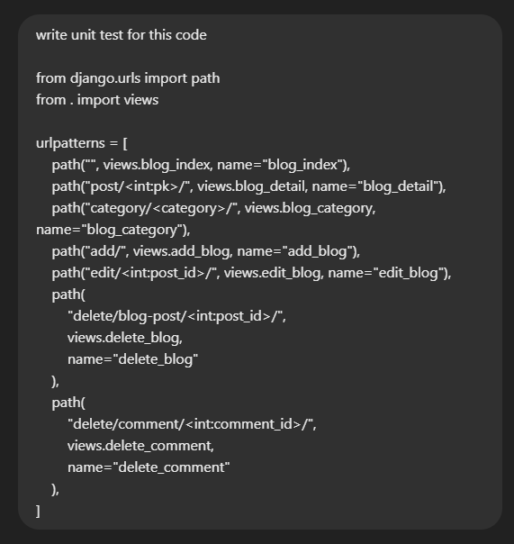
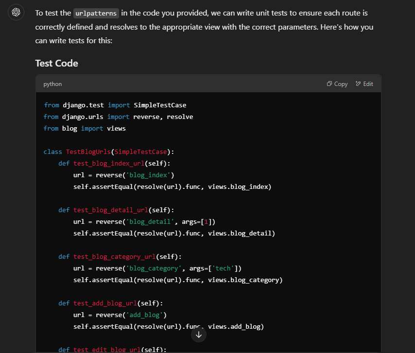
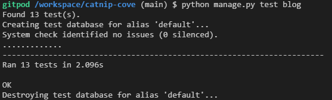

# **Catnip Cove Testing Results**


<br/>

**[Link to the Deployed Site]** - [Catnip Cove](https://catnip-cove-8a89db282e0c.herokuapp.com/)

---
## TABLE OF CONTENTS

* [Automated Testing and Validation](#automated-testing-and-validation)
    * [HTML Validation](#html-validation)
    * [CSS Validation](#css-validation)
    * [JavaScript Validation](#javascript-validation)
    * [Python Validation](#python-validation)
    * [Lighthouse Report](#lighthouse-report)
        * [Desktop](#desktop)
        * [Mobile](#mobile)
    * [WAVE Web Accessibility Evaluation Tool](#wave-web-accessibility-evaluation-tool)
    * [Django Automated Testing](#django-automated-testing)
        * [Coverage](#coverage)
* [Manual Testing](#manual-testing)
    * [Testing User Stories](#testing-user-stories)
    * [Full Testing](#full-testing)
* [Bugs, Errors & Solutions](#bugs-found-during-testing-and-development-phase)
    * [Solved Bugs](#solved-bugs)
    * [Known Bugs](#known-bugs)
---

## Automated Testing and Validation
### HTML Validation
I used [W3C Markup Validation Service](https://validator.w3.org/) to validate all the HTML files by url and direct input:
| Page | Result | Validation Details & Screenshots |
| ---- | :-: | -------------------------- |
| 'templates/home/index.html' | 0 errors and 0 warnings | [Home Page](./documentation/validation/html_validation/html-validator-home-page.png) |
| 'templates/home/contact.html' | 0 errors and 0 warnings | [Contact Us Page](./documentation/validation/html_validation/html-validator-contact-page.png) |
| 'templates/cats/cats.html' | 0 errors and 0 warnings | [Cats Page](./documentation/validation/html_validation/html-validator-cats-page.png) |
| 'templates/cats/cat_detail.html' | 0 errors and 0 warnings | [Cat Detail Page](./documentation/validation/html_validation/html-validator-cat-detail-page.png) |
| 'templates/cats/add_cat.html' | 0 errors and 0 warnings | [Add Cat Page](./documentation/validation/html_validation/html-validator-add-cat-page.png) |
| 'templates/cats/edit_cat.html' | 0 errors and 0 warnings | [Edit Cat Page](./documentation/validation/html_validation/html-validator-edit-cat-page.png) |
| 'templates/blog/blog_index.html' | 0 errors and 0 warnings | [Blog Index Page](./documentation/validation/html_validation/html-validator-blog-page.png) |
| 'templates/blog/blog_detail.html' | 0 errors and 0 warnings | [Blog Detail Page](./documentation/validation/html_validation/html-validator-blog-article.png) |
| 'templates/blog/category.html' | 0 errors and 0 warnings | [Blog Category Page](./documentation/validation/html_validation/html-validator-blog-category-page.png) |
| 'templates/blog/add_blog.html' | 0 errors and 0 warnings | [Add Blog Page](./documentation/validation/html_validation/html-validator-add-blog-page.png) |
| 'templates/blog/edit_blog.html' | 0 errors and 0 warnings | [Edit Blog Page](./documentation/validation/html_validation/html-validator-edit-blog-page.png) |
| 'templates/donations/donate.html' | 0 errors and 0 warnings | [Donation Page](./documentation/validation/html_validation/html-validator-donation-page.png) |
| 'templates/donations/success.html' | 0 errors and 0 warnings | [Donation Success Page](./documentation/validation/html_validation/html-validator-donation-success.png) |
| 'templates/profiles/profile.html' | 0 errors and 0 warnings | [Profile Page](./documentation/validation/html_validation/html-validator-profile-page.png) |
| 'templates/allauth/account/login.html' | 0 errors and 0 warnings | [Log In Page](./documentation/validation/html_validation/html-account-signin-page.png) |
| 'templates/allauth/account/logout.html' | 0 errors and 0 warnings | [Log Out Page](./documentation/validation/html_validation/html-validator-logout-page.png) |
| 'templates/allauth/account/signup.html' | 4 errors and 0 warnings | [Sign Up Page](./documentation/validation/html_validation/html-account-signup-page.png) |
| 'templates/allauth/account/password_rest.html' | 0 errors and 0 warnings | [Password Page](./documentation/validation/html_validation/html-password-reset-page.png) |
| 404 page | 0 errors and 0 warnings | [404 page](./documentation/validation/html_validation/html-validator-404-error-page.png) |

Errors found on the signup page was left as I could not figure out where these came from due it being a pre-defined Allauth template using django templating language and could not see any tags that hadn't been closed/where the stray tags were/other templates used in conjunction. With more time, I would have liked to investigate these in-depth and resolve the errors, the page still works as it should.

### CSS Validation
I used [W3C CSS Validation Service](https://jigsaw.w3.org/css-validator/) to validate all CSS files by direct input.
| File | Result | Test Details & Screenshots |
| ---- | :-: | -------------------------- |
| blog/static/blog/css/blog.css | Pass | [blog.css](./documentation/validation/css_validation/css-validator-blog.png) |
| donations/static/donations/css/donation.css | Pass with warnings | [donation.css](./documentation/validation/css_validation/css-validator-donations.png) [warnings donation.css](./documentation/validation/css_validation/css-validator-donations-warnings.png) |
| profiles/static/profiles/css/profile.css | Pass | [profile.css](./documentation/validation/css_validation/css-validator-profile.png) |
| static/css/base.css | Pass with warnings | [base.css](./documentation/validation/css_validation/css-validator-base.png) [warnings base.css](./documentation/validation/css_validation/css-validator-base-warnings.png)|

All warnings mentioned above relate to webkits and a border colour for a checkbox which is intentional.

### JavaScript Validation
I used [JSHint](https://jshint.com/) to validate all JavaScript and JQuery files
| Page/File | Result | Test Details & Screenshots |
| ---- | :-: | -------------------------- |
| donations/static/donations/js/stripe_elements.js | 0 errors 21 warnings | [Stripe Element JS](./documentation/validation/js_validation/js-validator-stripe-elements-file.png) [Stripe Element JS Continued](./documentation/validation/js_validation/js-validator-stripe-elements-file2.png) |
| blog/templates/blog/add_blog.html | 0 errors 7 warnings | [Widget Script](./documentation/validation/js_validation/js-validator-script-add-blog-page.png) |
| blog/templates/blog/edit_blog.html | 0 errors 7 warnings | [Widget Script](./documentation/validation/js_validation/js-validator-script-edit-blog-page.png) |
| cats/templates/cats/add_cat.html | 0 errors 7 warnings| [Widget Script](./documentation/validation/js_validation/js-validator-script-add-cat-page.png) |
| cats/templates/cats/edit_cat.html | 0 errors 7 warnings | [Widget Script](./documentation/validation/js_validation/js-validator-script-edit-cat-page.png) |
| cats/templates/cats/cats.html  | 0 errors 5 warnings | [Cat Sorting & Back To Top of Page Script](./documentation/validation/js_validation/js-validator-script-cats-page.png) |
| home/templates/home/contact.html | 0 errors 0 warnings | [Contact Form Script](./documentation/validation/js_validation/js-validator-script-contact-page.png) |

Any warnings received have all been to do with ES6 & ES11 and no errors with the actual code.

### Python Validation
I used [Code Institute's Python Linter](https://pep8ci.herokuapp.com/) to lint my Python code.
| File | Result | Validation Details & Screenshots |
| :-- | :-: | -------------------------- |
| custom_storages.py | All clear, no errors found | [custom_storages.py](./documentation/validation/python_validation/python-linter-custom-storages.png)|
| **CATNIP COVE** |  |  |
| catnip_cove/settings.py | All clear, no errors found | [Catnip Cove settings.py validation](./documentation/validation/python_validation/python-linter-catnip-cove-settings.png) |
| catnip_cove/urls.py | All clear, no errors found | [Catnip Cove urls.py validation](./documentation/validation/python_validation/python-linter-catnip-cove-urls.png) |
| catnip_cove/wsgi.py | All clear, no errors found | [Catnip Cove wsgi.py validation](./documentation/validation/python_validation/python-linter-catnip-cove-wsgi.png) |
| **BLOG APP** |  |  |
| blog/widgets.py | All clear, no errors found | [Blog widgets.py validation](./documentation/validation/python_validation/python-linter-blog-widgets.png) |
| blog/views.py | All clear, no errors found | [Blog views.py validation](./documentation/validation/python_validation/python-linter-blog-views.png) |
| blog/urls.py | All clear, no errors found | [Blog urls.py validation](./documentation/validation/python_validation/python-linter-blog-urls.png) |
| blog/models.py | All clear, no errors found | [Blog models.py validation](./documentation/validation/python_validation/python-linter-blog-models.png) |
| blog/forms.py | All clear, no errors found | [Blog forms.py validation](./documentation/validation/python_validation/python-linter-blog-forms.png) |
| blog/apps.py | All clear, no errors found | [Blog apps.py validation](./documentation/validation/python_validation/python-linter-blog-apps.png) |
| blog/admin.py | All clear, no errors found | [Blog admin.py validation](./documentation/validation/python_validation/python-linter-blog-admin.png) |
| blog/tests/test_models.py | All clear, no errors found | [Blog testing test_models.py validation](./documentation/validation/python_validation/python-linter-blog-test-models.png) |
| blog/tests/test_urls.py | All clear, no errors found | [Blog testing test_urls.py validation](./documentation/validation/python_validation/python-linter-blog-test-urls.png) |
| **CATS APP** |  |  |
| cats/widgets.py | All clear, no errors found | [Cats widgets.py validation](./documentation/validation/python_validation/python-linter-cats-widgets.png) |
| cats/views.py | All clear, no errors found | [Cats views.py validation](./documentation/validation/python_validation/python-linter-cats-views.png) |
| cats/urls.py | All clear, no errors found | [Cats urls.py validation](./documentation/validation/python_validation/python-linter-cats-urls.png) |
| cats/models.py | All clear, no errors found | [Cats models.py validation](./documentation/validation/python_validation/python-linter-cats-models.png) |
| cats/forms.py | All clear, no errors found | [Cats forms.py validation](./documentation/validation/python_validation/python-linter-cats-forms.png) |
| cats/apps.py | All clear, no errors found | [Cats apps.py validation](./documentation/validation/python_validation/python-linter-cats-apps.png) |
| cats/admin.py | All clear, no errors found | [Cats admins.py validation](./documentation/validation/python_validation/python-linter-cats-admin.png) |
| **DONATION APP** |  |  |
| donations/admin.py | All clear, no errors found | [Donations admin.py validation](./documentation/validation/python_validation/python-linter-donations-admin.png) |
| donations/apps.py | All clear, no errors found | [Donations apps.py validation](./documentation/validation/python_validation/python-linter-donations-apps.png) |
| donations/forms.py | All clear, no errors found | [Donations forms.py validation](./documentation/validation/python_validation/python-linter-donations-forms.png) |
| donations/models.py | All clear, no errors found | [Donations models.py validation](./documentation/validation/python_validation/python-linter-donations-models.png) |
| donations/urls.py | All clear, no errors found | [Donations urls.py validation](./documentation/validation/python_validation/python-linter-donations-urls.png) |
| donations/views.py | All clear, no errors found | [Donations views.py validation](./documentation/validation/python_validation/python-linter-donations-views.png) |
| donations/webhook_handler.py | All clear, no errors found | [Donations webhook_handler.py validation](./documentation/validation/python_validation/python-linter-donations-webhook-handler.png) |
| donations/webhooks.py | All clear, no errors found | [Donations webhooks.py validation](./documentation/validation/python_validation/python-linter-donations-webhooks.png) |
| **HOME APP** |  |  |
| home/apps.py | All clear, no errors found | [Home apps.py validation](./documentation/validation/python_validation/python-linter-home-apps.png) |
| home/urls.py | All clear, no errors found | [Home urls.py validation](./documentation/validation/python_validation/python-linter-home-urls.png) |
| home/views.py | All clear, no errors found | [Home views.py validation](./documentation/validation/python_validation/python-linter-home-views.png) |
| **PROFILES APP** |  |  |
| profiles/apps.py | All clear, no errors found | [Profiles apps.py validation](./documentation/validation/python_validation/python-linter-profiles-apps.png) |
| profiles/forms.py | All clear, no errors found | [Profiles forms.py validation](./documentation/validation/python_validation/python-linter-profiles-forms.png) |
| profiles/models.py | All clear, no errors found | [Profiles models.py validation](./documentation/validation/python_validation/python-linter-profiles-models.png) |
| profiles/urls.py | All clear, no errors found | [Profiles urls.py validation](./documentation/validation/python_validation/python-linter-profiles-urls.png) |
| profiles/views.py | All clear, no errors found | [Profiles views.py validation](./documentation/validation/python_validation/python-linter-profiles-views.png) |

### Lighthouse Report
[Chrome DevTools' Lighthouse](https://developer.chrome.com/docs/lighthouse/overview/) was used to test the performance, accessibility, best practices and SEO of the site
#### Desktop
| Page | Result | Screenshot |
| :-- | :-: | :-: |
| index.html | PASS | [index.html desktop lighthouse result](./documentation/validation/lighthouse/desktop-index.png) |
| cats.html | PASS | [cats.html desktop lighthouse result](./documentation/validation/lighthouse/desktop-cats.png) |
| cat_detail.html | PASS | [cat_detail.html desktop lighthouse result](./documentation/validation/lighthouse/desktop-cat-detail.png) |
| contact.html | PASS | [contact.html desktop lighthouse result](./documentation/validation/lighthouse/desktop-contact.png) |
| donate.html | Score 89% - 1% from PASS | [donate.html desktop lighthouse result](./documentation/validation/lighthouse/desktop-donate.png) |
| blog_index.html | PASS | [blog_index.html desktop lighthouse result](./documentation/validation/lighthouse/desktop-blog-index.png) |

#### Mobile
| Page | Result | Screenshot |
| :-- | :-: | :-: |
| index.html | PASS | [index.html mobile lighthouse result](./documentation/validation/lighthouse/mobile-index.png) |
| cats.html | Score 86% - 4% from PASS | [cats.html mobile lighthouse result](./documentation/validation/lighthouse/mobile-cats.png) |
| cat_detail.html | Score 89% - 1% from PASS | [cat_detail.html mobile lighthouse result](./documentation/validation/lighthouse/mobile-cat-detail.png) |
| contact.html | Score 89% - 1% from PASS | [contact.html mobile lighthouse result](./documentation/validation/lighthouse/mobile-contact.png) |
| donate.html | Score 68% | [donate.html mobile lighthouse result](./documentation/validation/lighthouse/mobile-donate.png) |
| blog_index.html | Score 89% - 1% from PASS | [blog_index.html mobile lighthouse result](./documentation/validation/lighthouse/mobile-blog-index.png) |

I would have liked to improve the mobile scores more, but due to time constraints this could not be done and would be implemented in a future version.

### WAVE Web Accessibility Evaluation Tool
[WAVE](https://wave.webaim.org/) was used to ensure that Catnip Cove's content is easily accessible to individuals with disabilities. WAVE assesses the page and identifies many accessibility and Web Content Accessibility Guideline (WCAG) errors, including contrast errors and general accessibility errors within the HTML code, which can then be rectified following the results of the initial evaluation.

I used the WAVE Chrome extension to enable testing of the public pages and also any pages that require user authentication.

| Page | WAVE Page Result | Reasons for not fixing the contrast errors, if any |
| :-- | --- | --- |
| Home Page | no errors | - |
| Cats Page | no errors | - |
| Cat Detail Page | no errors | - |
| Add a Cat Page  | no errors | - |
| Edit a Cat Page  | no errors, 1 alert | The alert pointed to some text that is hidden for the current cat image, as this was part of the widget created with the Boutique Ado walkthrough, as it's only an alert, I have left it as it is |
| Contact Page | no errors | - |
| Donate Page | no errors, 1 alert | The alert points to an 'orphaned form label', which is the credit/debit card form input label, as this is to do with stripe and only an alert, I have left as it is |
| Profile Page | 5 errors | Fixed: The crispy form did not render 5 labels, I couldn't find a solution by googling so I turned to chatGPT which gave the code and satisfied the WAVE errors; "self.fields[field].widget.attrs['aria-label'] = placeholders.get(field, field.replace('_', ' ').capitalize())" added to the form.py file |
| Blog Index Page | no errors | - |
| Add a Blog Page | no errors | - |
| Edit a Blog Page | no errors, 1 alert | The alert was regarding the alt text for the current blog image, the same as the edit cat page alert so this was left as well |
| Blog Detail Page | no errors, 2 alerts | One alert applied to headings, which I changed the code but they did not clear, I assume this is a caching issue, tried to clear the website cache but it still did not work. The other alert was for a minor unordered list that was within the blog article itself so this was ignored |
| Blog Category Page | no errors | - |
| 404 Error Page | no errors | - |

Following this testing, some changes were made to the navigation bar background colour and button colours which were giving contrast errors in order to receive the results above.

### Django Automated Testing
Automated testing is accomplished by writing test cases that target various components of the code, such as models, forms, urls and views, typically within seperate test.py files (such as test_models.py, test_urls.py etc.), and running those tests automatically to verify that the code behaves as expected, ensuring correctness and reliability throughout development. 
After reading the testing documentation and only really understanding how to run the tests once they had been written, I did not really know where to start with defining my own testing, so to better understand the unit testing, I asked chatGPT how to approach the process. The tests were carried out using Django's built in module [Django's built in test module](https://docs.djangoproject.com/en/4.1/topics/testing/overview/), with instruction from ChatGPT.

ChatGPT advised of certain installed apps that need to be present and to ensure debug was set to false for faster tests. It described the process for creating the folders and files for testing, which I already understood and provided examples for testing. As I still didn't understand how to formulate the actual tests, I asked ChatGPT to do testing for my blog app's urls and models. After it provided the testing code, it provided explanations and breakdowns of the imported SimpleTestCase class from the django.test module (which is used for tests that don't require a database, TestCase is for tests that do) and the functions it used within the provided test code and what each test does.

I asked chatGPT:

<br><br>

ChatGPT's response:

<br><br>

For just the blog application, I created a folder called tests, added the ```__init__.py``` file and the separate files for testing the urls and models.

Then to run the tests I typed ``` python manage.py test ``` in the terminal and the tests passed - result below.

RESULTS:<br><br>


Due to time constraints, I initially was not going to include automated testing as I was unable to get to grips with the process of writing the tests myself but with more time, I would have liked to implement this on all of the projects apps myself.

#### Coverage
I also used coverage to generate a report to measure which parts of the blog app code was actually tested by those tests, I am new to using Automated Testing and would research this more extensively with more time.
Coverage needed to be installed by typing ``` pip install coverage ``` in the terminal, then by running ``` coverage run --source=blog manage.py test blog ``` (this command was sourced from chatGPT again) to run the testing and coverage so that it can measure the files within the blog app. Then by typing ``` coverage report ``` in the terminal, the below report is produced (there is also an option to produce a more user friendly report by replacing report with "html" and then typing ``` start htmlcov/index.html ``` in the terminal to view the report).

| Installed App Coverage Report | Cover in Percentage | Screenshot of Coverage Report |
| -- | :-: | :-: |
| blog app | 70% | [blog app coverage report](./documentation/testing/automated_testing/blog-coverage-report.png) |

---
## Manual Testing
### Testing User Stories
### **User Stories**
| **User Story #** | **As a/an** | **I want to be able to...** | **So that I can...** | **How was this achieved** | **Evidence**
| :-- | :-- | :-- | :-- | :-- | :-- |
| **VIEWING & NAVIGATION** |  |  |  |  |  |
| 1 | First Time User | Understand the concept of the website and how to use it | See what the site is about | The home page displays a clear navigation bar that has self explanatory links with text logo for the rescue, hero image, welcome header and small section of text that introduces the user to the rescue centre and explains about the rescue center | [Home Page Screenshot](./documentation/features/home-page-screenshot.png) |
| 2 | First Time User | Go to the cat records & filter/sort them | See the cats at the rescue | The Home page features a "meet the cats" button that takes the user to the cats page when clicked, or there is a "cats" link within the navigation bar that contains a dropdown so the user can choose all cats or male/female cats. Once on the desired page, there is a button group at the top of the page which allows the user to filter by breed and colour also (it also contains the previous male/female cats options)| See above home page screenshot <br> [Cats Dropdown Menu Desktop](./documentation/testing/manual_testing/screenshots/cat-dropdown-menu.png) <br> [Cats Dropdown Menu Mobile](./documentation/testing/manual_testing/screenshots/cat-dropdown-mobile.png) <br> [Cats Sorting Buttons](./documentation/features/filter-buttons-feedback.png) |
| 3 | First Time User | Contact the rescue centre | Offer to volunteer or ask any questions I may have | The users can quickly find the contact link within the main navigation bar, which takes them to the contact form page | [Main Nav Links](./documentation/testing/manual_testing/screenshots/main-nav-links.png) <br> [Contact Page Screenshot](./documentation/features/contact-page-screenshot.png) |
| 4 | First Time User | Easily navigate to any of the other pages, from every page | Go wherever I choose on the website | The main navigation bar appears on every page | [Navigation Bar Screenshot](./documentation/features/nav-bar-screenshot.png) |
| 5 | Donator | Navigate to the correct page to donate | Make a general donation to the rescue | There is a donate link within the main navigation bar | Refer to above screenshot |
| 6 | Superuser/Admin | View special pages to adjust the records on the website | Keep records up-to-date and what I want to be on the site | When a superuser is logged into the website, they can access a drop down menu that includes cat/blog management pages, only available to them | [Superuser/Admin Menu Links](./documentation/testing/manual_testing/screenshots/superuser-my-account-dropdown.png) |
| **REGISTRATION & USER ACCOUNTS** |   |   |  |  |
| 7 | First Time User | Sign up for an account easily | Have a user profile and the perks that come with that | When a user clicks on the My account dropdown menu, it will display a link for registering, once the user clicks this link, it takes them to a sign up page which asks for email, username and password | [My Account Dropdown Menu](./documentation/testing/manual_testing/screenshots/my-account-dropdown-not-logged-in.png) <br> [Sign Up Page Screenshot](./documentation/features/sign-up-screenshot.png) |
| 8 | Registered User | Receive an email confirmation of my registration | Confirm my sign up was successful | The user enters the required information to sign up, they are directed to a page which asks them to verify their email address. User clicks on link to verify their email address and is taken to a page to confirm their email address is correct and clicks on a confirm button. The user then receives a toast to say that they have confirmed the email address and taken to the sign in page. | [Verify Email Screenshot](./documentation/testing/manual_testing/screenshots/email-verification-user-signup.png) <br> [Confirmation toast](./documentation/testing/manual_testing/screenshots/confirmed-email-signup.png) |
| 9 | Registered User | Easily log in and out of my account | Access my personal information and to be able to logout of my account for security | Clicking on the my account dropdown shows a link to sign in, the user is then directed to the sign in page. Once logged in the same my account menu has a link for logging out, once clicked, the user is directed to a page to confirm they want to log out. The user can then click sign out and a confirmation of the user being logged out is displayed | Refer to above screenshots for my account dropdown menu login and logout <br> [Sign Out Page](./documentation/features/sign-out-screenshot.png) <br> [Sign Out Confirmation](./documentation/testing/manual_testing/screenshots/sign-out-confirmation.png) |
| 10 | Registered User | Recover my password | Gain access if I forget my password | There is a forgot your password link on the login/sign in screen | [Forgot Password Link](./documentation/testing/manual_testing/screenshots/forgot-password-link.png) |
| 11 | Registered User | Have a personalised profile | To view my donation history and donation confirmations | Once the user is logged on, a profile link appears in the my account dropdown menu, the profile page consists of appropriate headers, an area to keep the users details up-to-date and the users donation history | [My Profile Screenshot](./documentation/testing/manual_testing/screenshots/profile-screenshot.png) |
| 12 | Donator | View a list of all the donations I have made already | Keep track of my spending | A donator can only keep track of donations by either signing up for an account, which they are instructed to do at the bottom of the donation form if the user is not logged in/does not have an account, or by keeping their confirmation emails. If a user is logged in, the donation form gives them an option to save their details as well in case of any changes | See above Profile screenshot for donation history display <br>[Donation Form Create Account Message](./documentation/testing/manual_testing/screenshots/donation-record-create-account.png) <br> [Donation Form Save Info](./documentation/testing/manual_testing/screenshots/donation-record-add-to-account.png) |
| 13 | Superuser/Admin | Gain access from my account to page for creating, reading, editing or deleting the cat records | Keep the website up-to-date | Once a superuser/admin user is logged in, the dropdown menu displays two links for cat and blog management where a user can add a cat or blog record. The user can also visit the records themselves where edit/delete buttons appear at various stages. | [Management Links](./documentation/testing/manual_testing/screenshots/my-account-dropdown.png) <br> [Edit/Delete Buttons - Cats](./documentation/testing/manual_testing/screenshots/cats-edit-delete-buttons.png) <br> [Edit/Delete Buttons - Blog](./documentation/testing/manual_testing/screenshots/blog-edit-delete-buttons.png)|
| **SORTING & SEARCHING** |   |   |  |  |
| 14 | First Time User | Sort cats by breed, colour or sex | To find a cat of a particular category | The user can select Male/Female cats from the cats nav bar link dropdown menu, then once on the page of their choosing, they can further select colour or breed, presented in another dropdown menu. Each one has a list of all breeds/colours that exist in the database, this will then load the appropriate results - Evidence shows sorting by breed but tested the same for colour | [Sort By Breed Menu](./documentation/testing/manual_testing/screenshots/cat-sort-by-breed-menu.png) <br> [Sort By Breed Results](./documentation/testing/manual_testing/screenshots/cat-sort-by-breed-results.png) |
| 15 | Frequent User | Search for cats by typing their name, colour or breed in the search bar | To find a cat of a particular category | The search bar is available on all pages, if a name, colour or breed in the search bar, it will return results of cats that match the criteria - Evidence again shows searching by breed but tests for colour and name were also carried out and passed | [Search By Breed](./documentation/testing/manual_testing/screenshots/search-bar-breed-test.png) <br> [Search By Breed Results](./documentation/testing/manual_testing/screenshots/search-bar-breed-result.png) |
| 16 | General User | Easily see my search results and the number of records | See how many cats are at the rescue in the breed/colour/sex I typed  | The number of results is always on display above the cat records | [Cat Result Counter](./documentation/testing/manual_testing/screenshots/cat-results-counter.png) |
| **DONATING** |   |   |  |  |
| 17 | Donator | Make a donation for a particular cat | Make a donation that will be spent on a particular cat | Unfortunately, I did not get time to complete this so unable to complete this - There is an added comment box on the donation form so a user could specify a particular cat if they wanted | [Donation Form Message Box](./documentation/testing/manual_testing/screenshots/donation-form-message-box.png) |
| 18 | Donator | Make a different donation than any suggested amounts | Pay as much as I want | There is only one amount box on the donation form, therefore the user can pay any amount they like, from £1 upwards by way of a validation message if the user enters 0 or a minus figure | [Donation Amount Box Minus Figure](./documentation/testing/manual_testing/screenshots/donation-amount-minus.png) |
| 19 | Donator | Fill in the donation form easily and quickly | Make a donation without too much hassle | The user will navigate from the main navigation bar donation link and the form is presented, auto-fill is enabled to provide ease for the user and only a few details are needed to make donation quick | [Donation Form Fields](./documentation/testing/manual_testing/screenshots/donation-form.png) |
| 20 | Donator | View a donation confirmation after it has processed | Verify everything is correct | By navigating to the user profile, a list of previous donations made are on the right of the page. Each donation has a clickable link of the donation number, after clicking on this, the user is taken to a page displaying the past donation confirmation information, including time and date of the donation and email that the donation confirmation was sent to | [Past Donation Confirmation](./documentation/testing/manual_testing/screenshots/past-donation-confirmation.png) |
| 21 | Donator | Receive an email confirmation of the donation |  To keep records of my spending | Following the user making a successful donation, they should receive an email confirmation of the donation and amount to the email address provided in the donation form | [Test Payment Form](./documentation/testing/manual_testing/screenshots/test-donation-payment.png) <br> [Test Payment Success](./documentation/testing/manual_testing/screenshots/test-donation-payment-confirmation.png) <br> [Test Payment Confirmation Email Received](./documentation/testing/manual_testing/screenshots/test-donation-payment-confirmation-email.png) <br> [Test Payment Email Body](./documentation/testing/manual_testing/screenshots/test-donation-payment-confirmation-email-message.png) |
| **BLOG** |   |   |  |  |
| 22 | Registered User | View blog articles & comments | Gain information about cats | When the user is logged in, a new link appears in the my account dropdown menu called Members Blog | [Logged In User Menu](./documentation/testing/manual_testing/screenshots/logged-in-user-my-acount-dropdown.png) |
| 23 | Registered User | View blog articles in a certain category | View all articles in that category | Each article has a category as a link beneath the title, the user clicks on this link and is taken to another page with all articles in that category | [Blog Category Page](./documentation/testing/manual_testing/screenshots/blog-category-blog-list.png) |
| 24 | Registered User | Make comments on blog articles | Contribute to the community or ask questions | Scrolling to the bottom of a blog article displays the comments section, where it traditionally is expected to be and the user will find the form for adding a comment underneath | [Blog Comment Section](./documentation/testing/manual_testing/screenshots/blog-comments-section.png) |
| 25 | Registered User | Easily navigate back to the initial blog page | Go back and view more articles | There is a back to blogs button below the comments section | See above screenshot |
| 26 | Superuser/Admin | Create, read, edit, update and delete blog articles | Have control over the content on the blog | A superuser can navigate to the blog management page from the my account dropdown, or visit any blog article to edit or delete | See below screenshots in **ADMIN & STORE MANAGEMENT** |
| 27 | Superuser/Admin | Read and delete inappropriate comments | Have control over the comments on the blog | The superuser navigates to the blog article, scrolls to the comment section, beneath each comment, there is a delete button | [Comment Delete Button](./documentation/testing/manual_testing/screenshots/comment-delete-button.png) |
| **ADMIN & STORE MANAGEMENT** |  |  |  |  |
| 28 | Superuser/Admin | Add a cat/blog | Add new cats to the site | Once logged in, the superuser can click on the my account dropdown, click on the cat management/blog management which takes them to a form to add a cat/blog including pictures | [Cat Management Page](./documentation/features/cat-management-form-top.png) [Blog Management Page](./documentation/features/blog-management-form.png) |
| 29 | Superuser/Admin | Edit a cat/blog | Keep records up-to-date | Once logged in, the superuser can visit any cat/blog record and edit/delete buttons will be in a couple of different places - refer to screenshots for point 13. The user can click the edit button and will be taken to a page with a form of pre-filled information from the record | [Edit Cat Record](./documentation/testing/manual_testing/screenshots/cat-edit-record.png) <br> [Edit Blog Record](./documentation/testing/manual_testing/screenshots/blog-edit-record.png) |
| 30 | Superuser/Admin | Delete a cat/blog/comment | Keep records/blogs up-to-date, remove cats that are no longer in the rescue centre and blogs/comments that are no longer required or inappropriate | As above with the placement of the buttons, except when the delete button is pressed, a modal is triggered to confirm the user is happy to delete the record | Detailed Below |
| 31 | Superuser/Admin | Receive a warning when I click the delete button | Avoid accidental deletion of a cat record/blog/comment | Any time a delete button is pressed on a cat record, blog article or comment, a modal is triggered | [Delete Modal Blog](./documentation/features/modal-delete-blog-comment.png) <br> [Delete Modal Cat](./documentation/features/modal-delete-cat.png)  |

### Full Testing
Full testing was conducted using the following physical devices:
* Mobile:
    * iPhone 14 Plus
* Desktop
    * 27 inch Monitor on Desktop PC

---
## Bugs found during testing and development phase
### Solved Bugs
| # | Bugs, Errors and Issues | Solutions |
| :--- | :--- | :--- |
| 1 | At beginning of project, had compatability issues with installing allauth with the current version of python/django packages I already had  | to rectify this I just tried to install the latest version of allauth, which worked. |
| 2 | I then found that I couldn't migrate the changes, the error itself told me " 'allauth.account.middleware.AccountMiddleware' must be added to settings.MIDDLEWARE" | I added the line to the middleware section in my settings.py under installed apps. |
| 3 | After this I was able to migrate but when I went to the admin page to try and login, I then received an error stating "CSRF verification failed. Request aborted." | I looked up on Slack and there was a solution posted due to a previous bug; ``` CSRF_TRUSTED_ORIGINS = ['https://*.codeinstitute-ide.net/', 'https://*.herokuapp.com'] ``` I added this code into my settings.py file and I was then able to login to the admin page. |
| 4 | Cats page takes a long time to load and when scrolling, the page lags due to large amount of pictures displayed  | I compressed all of the pics using an online converter where they allow you to convert the file to WEBP and resize all images all in one go! |
| 5 |  Search box returns all records instead of ones that match the search term | Looked over code and found the indentation was incorrect |
| 6 | Had issues with a template does not exist error | Used the following stack overflow, turned out it was as simple as adding 'crispy_bootstrap5' to installed apps
https://stackoverflow.com/questions/65238459/templatedoesnotexist-at-users-register-bootstrap5-uni-form-html |
| 7 | Toasts using the Boutique Ado tutorial were showing on some pages but not all & not closing when clicking the X button | Through research, I discovered Bootstrap 5 does not require JQuery to work, (I still used it for my Javascript for the Stripe Elements) but I replaced the toast javascript and layout with an adapted example from the Bootstrap 5 toasts [Toast documentation - usage](https://getbootstrap.com/docs/5.3/components/toasts/#usage) and [Toast documentation - basic](https://getbootstrap.com/docs/5.3/components/toasts/#basic) |
| 8 | The javascript for the widget in the Boutique Ado walkthrough, did not work for me and my project | I customised the code by following this [tutorial]
(https://betterprogramming.pub/handling-file-inputs-with-javascript-9f2d3a007f05) |
| 9 | I could not get the ``` {{ MEDIA_URL }}noimage.png ``` to show up using the method in the Boutique Ado tutorial, even though it is defined in 
my settings and the other images in media display | Through research I found this piece of code was missing from my context processors in project level settings.py file 'django.template.context_processors.media' |
| 10 | Webhooks were not working successfully | Sarah at CodeInstitute helped me by providing some code that she had previously done on a similar project, I just had to tweak it to make it work for my project |
| 11 | Donation Form would not update the profile details when the save info checkbox is ticked on | Looked at the code and realised the name of the checkbox had a dash instead of an underscore, changed it and it then worked |
| 12 | Could not view blogs | Realised I had changed the filename for the blog detail page, changed it back and it resolved the issue |


### Known Bugs
| # | Known Bugs, Errors and Issues | Justification |
| :--- | :--- | :--- |
| 1 | Browser: Chrome, Error: **Uncaught (in promise) Error: A listener indicated an asynchronous response by returning true, but the message channel closed before a response was received**. This error appears after about a minute or two of loading any page of the web application. | I have spent days looking for where this error was coming from, initially thinking it was caused by the show and hide button on the homepage to hide and show list of available brands. I switched off the event listener. The error still appeared. I tried to debug and refactor all the event listeners but found it impossible to do so without disabling the required JQuery functions for the application to run smoothly. Googling for possible causes and reasons, I have found references to the same error and they point to using incognito mode as a possible solution. The error did not appear when using incognito mode. Due to time constraints, the real solution for this error may be investigated further on the next sprint/ future development. |
| 2 | internal server error when registering a new account | This error came out of the blue since the account registration has been tested multiple times by friends and family and also by myself using temporary emails. After setting the project back and forth between DEBUG=True and DEBUG=False and even asking fellow students to test the account registration functionality, the server error did not appear again. Three other fellow students helped me try and uncover the source of this error by themselves registering a new account with Shop K-Beauty. None of them reported any error and the account registration worked as expected. I cannot recreate the error and neither does it appear again, but since I also did not knowingly solve this bug, I thought it best to list this as a known bug for now and one that I will try in the next sprint/ future development to investigate further. | -->