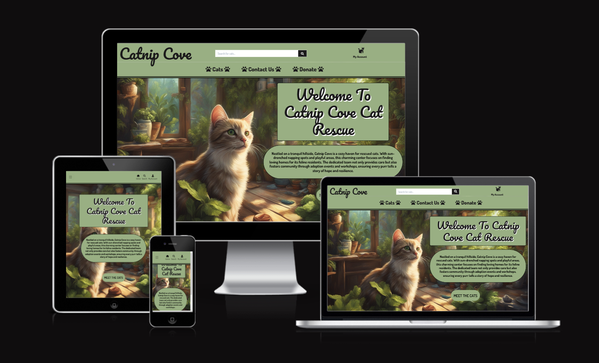

# **Catnip Cove Testing Results**



<br/>

**[Link to the Deployed Site]** - [Catnip Cove](https://catnip-cove-8a89db282e0c.herokuapp.com/)

---
## TABLE OF CONTENTS

* [Automated Testing and Validation](#automated-testing-and-validation)
    * [HTML Validation](#html-validation)
    * [CSS Validation](#css-validation)
    * [JavaScript Validation](#javascript-validation)
    * [Python Validation](#python-validation)
    * [Lighthouse Report](#lighthouse-report)
        * [Desktop](#desktop)
        * [Mobile](#mobile)
    * [WAVE Web Accessibility Evaluation Tool](#wave-web-accessibility-evaluation-tool)
    * [Django Automated Testing](#django-automated-testing)
        * [Coverage](#coverage)
* [Manual Testing](#manual-testing)
    * [Testing User Stories](#testing-user-stories)
    * [Full Testing](#full-testing)
* [Bugs, Errors & Solutions](#bugs-found-during-testing-and-development-phase)
    * [Solved Bugs](#solved-bugs)
    * [Known Bugs](#known-bugs)
---

## Automated Testing and Validation
### HTML Validation
I used [W3C Markup Validation Service](https://validator.w3.org/) to validate all the HTML files by url and direct input:
| Page | Result | Validation Details & Screenshots |
| ---- | :-: | -------------------------- |
| 'templates/home/index.html' | 0 errors and 0 warnings | [Home Page](./documentation/validation/html_validation/html-validator-home-page.png) |
| 'templates/home/contact.html' | 0 errors and 0 warnings | [Contact Us Page](./documentation/validation/html_validation/html-validator-contact-page.png) |
| 'templates/cats/cats.html' | 0 errors and 0 warnings | [Cats Page](./documentation/validation/html_validation/html-validator-cats-page.png) |
| 'templates/cats/cat_detail.html' | 0 errors and 0 warnings | [Cat Detail Page](./documentation/validation/html_validation/html-validator-cat-detail-page.png) |
| 'templates/cats/add_cat.html' | 0 errors and 0 warnings | [Add Cat Page](./documentation/validation/html_validation/html-validator-add-cat-page.png) |
| 'templates/cats/edit_cat.html' | 0 errors and 0 warnings | [Edit Cat Page](./documentation/validation/html_validation/html-validator-edit-cat-page.png) |
| 'templates/blog/blog_index.html' | 0 errors and 0 warnings | [Blog Index Page](./documentation/validation/html_validation/html-validator-blog-page.png) |
| 'templates/blog/blog_detail.html' | 0 errors and 0 warnings | [Blog Detail Page](./documentation/validation/html_validation/html-validator-blog-article.png) |
| 'templates/blog/category.html' | 0 errors and 0 warnings | [Blog Category Page](./documentation/validation/html_validation/html-validator-blog-category-page.png) |
| 'templates/blog/add_blog.html' | 0 errors and 0 warnings | [Add Blog Page](./documentation/validation/html_validation/html-validator-add-blog-page.png) |
| 'templates/blog/edit_blog.html' | 0 errors and 0 warnings | [Edit Blog Page](./documentation/validation/html_validation/html-validator-edit-blog-page.png) |
| 'templates/donations/donate.html' | 0 errors and 0 warnings | [Donation Page](./documentation/validation/html_validation/html-validator-donation-page.png) |
| 'templates/donations/success.html' | 0 errors and 0 warnings | [Donation Success Page](./documentation/validation/html_validation/html-validator-donation-success.png) |
| 'templates/profiles/profile.html' | 0 errors and 0 warnings | [Profile Page](./documentation/validation/html_validation/html-validator-profile-page.png) |
| 'templates/allauth/account/login.html' | 0 errors and 0 warnings | [Log In Page](./documentation/validation/html_validation/html-account-signin-page.png) |
| 'templates/allauth/account/logout.html' | 0 errors and 0 warnings | [Log Out Page](./documentation/validation/html_validation/html-validator-logout-page.png) |
| 'templates/allauth/account/signup.html' | 4 errors and 0 warnings | [Sign Up Page](./documentation/validation/html_validation/html-account-signup-page.png) |
| 'templates/allauth/account/password_rest.html' | 0 errors and 0 warnings | [Password Page](./documentation/validation/html_validation/html-password-reset-page.png) |
| 404 page | 0 errors and 0 warnings | [404 page](./documentation/validation/html_validation/html-validator-404-error-page.png) |

Errors found on the signup page was left as I could not figure out where these came from due it being a pre-defined Allauth template using django templating language and could not see any tags that hadn't been closed or where the stray tags were. With more time, I would have liked to investigate these in-depth and resolve the errors, the page still works as it should.

### CSS Validation
I used [W3C CSS Validation Service](https://jigsaw.w3.org/css-validator/) to validate all CSS files by direct input.
| File | Result | Test Details & Screenshots |
| ---- | :-: | -------------------------- |
| blog/static/blog/css/blog.css | Pass | [blog.css](./documentation/validation/css_validation/css-validator-blog.png) |
| donations/static/donations/css/donation.css | Pass with warnings | [donation.css](./documentation/validation/css_validation/css-validator-donations.png) [warnings donation.css](./documentation/validation/css_validation/css-validator-donations-warnings.png) |
| profiles/static/profiles/css/profile.css | Pass | [profile.css](./documentation/validation/css_validation/css-validator-profile.png) |
| static/css/base.css | Pass with warnings | [base.css](./documentation/validation/css_validation/css-validator-base.png) [warnings base.css](./documentation/validation/css_validation/css-validator-base-warnings.png)|

All warnings mentioned above relate to webkits and a border colour for a checkbox which is intentional.

### JavaScript Validation
I used [JSHint](https://jshint.com/) to validate all JavaScript and JQuery files
| Page/File | Result | Test Details & Screenshots |
| ---- | :-: | -------------------------- |
| donations/static/donations/js/stripe_elements.js | 0 errors 21 warnings | [Stripe Element JS](./documentation/validation/js_validation/js-validator-stripe-elements-file.png) [Stripe Element JS Continued](./documentation/validation/js_validation/js-validator-stripe-elements-file2.png) |
| blog/templates/blog/add_blog.html | 0 errors 7 warnings | [Widget Script](./documentation/validation/js_validation/js-validator-script-add-blog-page.png) |
| blog/templates/blog/edit_blog.html | 0 errors 7 warnings | [Widget Script](./documentation/validation/js_validation/js-validator-script-edit-blog-page.png) |
| cats/templates/cats/add_cat.html | 0 errors 7 warnings| [Widget Script](./documentation/validation/js_validation/js-validator-script-add-cat-page.png) |
| cats/templates/cats/edit_cat.html | 0 errors 7 warnings | [Widget Script](./documentation/validation/js_validation/js-validator-script-edit-cat-page.png) |
| cats/templates/cats/cats.html  | 0 errors 5 warnings | [Cat Sorting & Back To Top of Page Script](./documentation/validation/js_validation/js-validator-script-cats-page.png) |
| home/templates/home/contact.html | 0 errors 0 warnings | [Contact Form Script](./documentation/validation/js_validation/js-validator-script-contact-page.png) |

Any warnings received have all been to do with ES6 & ES11 and no errors with actual code.

### Python Validation
I used [Code Institute's Python Linter](https://pep8ci.herokuapp.com/) to lint my Python code.
| File | Result | Validation Details & Screenshots |
| :-- | :-: | -------------------------- |
| custom_storages.py | All clear, no errors found | [custom_storages.py](./documentation/validation/python_validation/python-linter-custom-storages.png)|
| **CATNIP COVE** |  |  |
| catnip_cove/settings.py | All clear, no errors found | [Catnip Cove settings.py validation](./documentation/validation/python_validation/python-linter-catnip-cove-settings.png) |
| catnip_cove/urls.py | All clear, no errors found | [Catnip Cove urls.py validation](./documentation/validation/python_validation/python-linter-catnip-cove-urls.png) |
| catnip_cove/wsgi.py | All clear, no errors found | [Catnip Cove wsgi.py validation](./documentation/validation/python_validation/python-linter-catnip-cove-wsgi.png) |
| **BLOG APP** |  |  |
| blog/widgets.py | All clear, no errors found | [Blog widgets.py validation](./documentation/validation/python_validation/python-linter-blog-widgets.png) |
| blog/views.py | All clear, no errors found | [Blog views.py validation](./documentation/validation/python_validation/python-linter-blog-views.png) |
| blog/urls.py | All clear, no errors found | [Blog urls.py validation](./documentation/validation/python_validation/python-linter-blog-urls.png) |
| blog/models.py | All clear, no errors found | [Blog models.py validation](./documentation/validation/python_validation/python-linter-blog-models.png) |
| blog/forms.py | All clear, no errors found | [Blog forms.py validation](./documentation/validation/python_validation/python-linter-blog-forms.png) |
| blog/apps.py | All clear, no errors found | [Blog apps.py validation](./documentation/validation/python_validation/python-linter-blog-apps.png) |
| blog/admin.py | All clear, no errors found | [Blog admin.py validation](./documentation/validation/python_validation/python-linter-blog-admin.png) |
| blog/tests/test_models.py | All clear, no errors found | [Blog testing test_models.py validation](./documentation/validation/python_validation/python-linter-blog-test-models.png) |
| blog/tests/test_urls.py | All clear, no errors found | [Blog testing test_urls.py validation](./documentation/validation/python_validation/python-linter-blog-test-urls.png) |
| **CATS APP** |  |  |
| cats/widgets.py | All clear, no errors found | [Cats widgets.py validation](./documentation/validation/python_validation/python-linter-cats-widgets.png) |
| cats/views.py | All clear, no errors found | [Cats views.py validation](./documentation/validation/python_validation/python-linter-cats-views.png) |
| cats/urls.py | All clear, no errors found | [Cats urls.py validation](./documentation/validation/python_validation/python-linter-cats-urls.png) |
| cats/models.py | All clear, no errors found | [Cats models.py validation](./documentation/validation/python_validation/python-linter-cats-models.png) |
| cats/forms.py | All clear, no errors found | [Cats forms.py validation](./documentation/validation/python_validation/python-linter-cats-forms.png) |
| cats/apps.py | All clear, no errors found | [Cats apps.py validation](./documentation/validation/python_validation/python-linter-cats-apps.png) |
| cats/admin.py | All clear, no errors found | [Cats admins.py validation](./documentation/validation/python_validation/python-linter-cats-admin.png) |
| **DONATION APP** |  |  |
| donations/admin.py | All clear, no errors found | [Donations admin.py validation](./documentation/validation/python_validation/python-linter-donations-admin.png) |
| donations/apps.py | All clear, no errors found | [Donations apps.py validation](./documentation/validation/python_validation/python-linter-donations-apps.png) |
| donations/forms.py | All clear, no errors found | [Donations forms.py validation](./documentation/validation/python_validation/python-linter-donations-forms.png) |
| donations/models.py | All clear, no errors found | [Donations models.py validation](./documentation/validation/python_validation/python-linter-donations-models.png) |
| donations/urls.py | All clear, no errors found | [Donations urls.py validation](./documentation/validation/python_validation/python-linter-donations-urls.png) |
| donations/views.py | All clear, no errors found | [Donations views.py validation](./documentation/validation/python_validation/python-linter-donations-views.png) |
| donations/webhook_handler.py | All clear, no errors found | [Donations webhook_handler.py validation](./documentation/validation/python_validation/python-linter-donations-webhook-handler.png) |
| donations/webhooks.py | All clear, no errors found | [Donations webhooks.py validation](./documentation/validation/python_validation/python-linter-donations-webhooks.png) |
| **HOME APP** |  |  |
| home/apps.py | All clear, no errors found | [Home apps.py validation](./documentation/validation/python_validation/python-linter-home-apps.png) |
| home/urls.py | All clear, no errors found | [Home urls.py validation](./documentation/validation/python_validation/python-linter-home-urls.png) |
| home/views.py | All clear, no errors found | [Home views.py validation](./documentation/validation/python_validation/python-linter-home-views.png) |
| **PROFILES APP** |  |  |
| profiles/apps.py | All clear, no errors found | [Profiles apps.py validation](./documentation/validation/python_validation/python-linter-profiles-apps.png) |
| profiles/forms.py | All clear, no errors found | [Profiles forms.py validation](./documentation/validation/python_validation/python-linter-profiles-forms.png) |
| profiles/models.py | All clear, no errors found | [Profiles models.py validation](./documentation/validation/python_validation/python-linter-profiles-models.png) |
| profiles/urls.py | All clear, no errors found | [Profiles urls.py validation](./documentation/validation/python_validation/python-linter-profiles-urls.png) |
| profiles/views.py | All clear, no errors found | [Profiles views.py validation](./documentation/validation/python_validation/python-linter-profiles-views.png) |

### Lighthouse Report
[Chrome DevTools' Lighthouse](https://developer.chrome.com/docs/lighthouse/overview/) was used to test the performance, accessibility, best practices and SEO of the site
#### Desktop
| Page | Result | Screenshot |
| :-- | :-: | :-: |
| index.html | PASS | [index.html desktop lighthouse result](./documentation/validation/lighthouse/desktop-index.png) |
| cats.html | PASS | [cats.html desktop lighthouse result](./documentation/validation/lighthouse/desktop-cats.png) |
| cat_detail.html | PASS | [cat_detail.html desktop lighthouse result](./documentation/validation/lighthouse/desktop-cat-detail.png) |
| contact.html | PASS | [contact.html desktop lighthouse result](./documentation/validation/lighthouse/desktop-contact.png) |
| donate.html | Score 89% - 1% from PASS | [donate.html desktop lighthouse result](./documentation/validation/lighthouse/desktop-donate.png) |
| blog_index.html | PASS | [blog_index.html desktop lighthouse result](./documentation/validation/lighthouse/desktop-blog-index.png) |

#### Mobile
| Page | Result | Screenshot |
| :-- | :-: | :-: |
| index.html | PASS | [index.html mobile lighthouse result](./documentation/validation/lighthouse/mobile-index.png) |
| cats.html | Score 86% - 4% from PASS | [cats.html mobile lighthouse result](./documentation/validation/lighthouse/mobile-cats.png) |
| cat_detail.html | Score 89% - 1% from PASS | [cat_detail.html mobile lighthouse result](./documentation/validation/lighthouse/mobile-cat-detail.png) |
| contact.html | Score 89% - 1% from PASS | [contact.html mobile lighthouse result](./documentation/validation/lighthouse/mobile-contact.png) |
| donate.html | Score 68% | [donate.html mobile lighthouse result](./documentation/validation/lighthouse/mobile-donate.png) |
| blog_index.html | Score 89% - 1% from PASS | [blog_index.html mobile lighthouse result](./documentation/validation/lighthouse/mobile-blog-index.png) |

I would have liked to improve the mobile scores more, but due to time constraints this could not be done and would be implemented in a future version.

### WAVE Web Accessibility Evaluation Tool
[WAVE](https://wave.webaim.org/) was used to ensure that Catnip Cove's content is easily accessible to individuals with disabilities. WAVE assesses the page and identifies many accessibility and Web Content Accessibility Guideline (WCAG) errors, including contrast errors and general accessibility errors within the HTML code, which can then be rectified following the results of the initial evaluation.

I used the WAVE Chrome extension to enable testing of the public pages and also any pages that require user authentication.

| Page | WAVE Page Result | Reasons for not fixing the contrast errors, if any |
| :-- | --- | --- |
| Home Page | no errors | - |
| Cats Page | no errors | - |
| Cat Detail Page | no errors | - |
| Add a Cat Page  | no errors | - |
| Edit a Cat Page  | no errors, 1 alert | The alert pointed to some text that is hidden for the current cat image, as this was part of the widget created with the Boutique Ado walkthrough, as it's only an alert, I have left it as it is |
| Contact Page | no errors | - |
| Donate Page | no errors, 1 alert | The alert points to an 'orphaned form label', which is the credit/debit card form input label, as this is to do with stripe and only an alert, I have left as it is |
| Profile Page | 5 errors | Fixed: The crispy form did not render 5 labels, I couldn't find a solution by googling so I turned to chatGPT which gave the code and satisfied the WAVE errors; "self.fields[field].widget.attrs['aria-label'] = placeholders.get(field, field.replace('_', ' ').capitalize())" added to the form.py file |
| Blog Index Page | no errors | - |
| Add a Blog Page | no errors | - |
| Edit a Blog Page | no errors, 1 alert | The alert was regarding the alt text for the current blog image, the same as the edit cat page alert so this was left as well |
| Blog Detail Page | no errors, 2 alerts | One alert applied to headings, which I changed the code but they did not clear, I assume this is a caching issue, tried to clear the website cache but it still did not work. The other alert was for a minor unordered list that was within the blog article itself so this was ignored |
| Blog Category Page | no errors | - |
| 404 Error Page | no errors | - |

Following this testing, some changes were made to the navigation bar background and button colours which were giving contrast errors in order to receive the results above.

### Django Automated Testing
Automated testing is accomplished by writing test cases that target various components of the code, such as models, forms, urls and views, typically within seperate test.py files (such as test_models.py, test_urls.py etc.), and running those tests automatically to verify that the code behaves as expected, ensuring correctness and reliability throughout development. 
After reading the testing documentation and only really understanding how to run the tests once they had been written, I did not really know where to start with defining my own testing, so to better understand the unit testing, I asked chatGPT how to approach the process. The tests were carried out using Django's built in module [Django's built in test module](https://docs.djangoproject.com/en/4.1/topics/testing/overview/), with instruction from ChatGPT.

ChatGPT advised of certain installed apps that need to be present and to ensure debug was set to false for faster tests. It described the process for creating the folders and files for testing, which I already understood and provided examples for testing. As I still didn't understand how to formulate the actual tests, I asked ChatGPT to do testing for my blog app's urls and models. After it provided the testing code, it provided explanations and breakdowns of the imported SimpleTestCase class from the django.test module (which is used for tests that don't require a database, TestCase is for tests that do) and the functions it used within the provided test code and what each test does.

I asked chatGPT:

<br><br>

ChatGPT's response:

<br><br>

For just the blog application, I created a folder called tests, added the ```__init__.py``` file and the separate files for testing the urls and models.

Then to run the tests I typed ``` python manage.py test ``` in the terminal and the tests passed - result below.

RESULTS:<br><br>


Due to time constraints, I initially was not going to include automated testing as I was unable to get to grips with the process of writing the tests myself but with more time, I would have liked to implement this on all of the projects apps myself.

#### Coverage
I also used coverage to generate a report to measure which parts of the blog app code was actually tested by those tests, I am new to using Automated Testing and would research this more extensively with more time.
Coverage needed to be installed by typing ``` pip install coverage ``` in the terminal, then by running ``` coverage run --source=blog manage.py test blog ``` (this command was sourced from chatGPT again) to run the testing and coverage so that it can measure the files within the blog app. Then by typing ``` coverage report ``` in the terminal, the below report is produced (there is also an option to produce a more user friendly report by replacing report with "html" and then typing ``` start htmlcov/index.html ``` in the terminal to view the report).

| Installed App Coverage Report | Cover in Percentage | Screenshot of Coverage Report |
| -- | :-: | :-: |
| blog app | 70% | [blog app coverage report](./documentation/testing/automated_testing/blog-coverage-report.png) |

---
## Manual Testing
### Testing User Stories
### **User Stories**
| **User Story #** | **As a/an** | **I want to be able to...** | **So that I can...** | **How was this achieved** | **Evidence**
| :-- | :-- | :-- | :-- | :-- | :-- |
| **VIEWING & NAVIGATION** |  |  |  |  |  |
| 1 | First Time User | Understand the concept of the website and how to use it | See what the site is about | The home page displays a clear navigation bar that has self explanatory links with text logo for the rescue, hero image, welcome header and small section of text that introduces the user to the rescue centre and explains about the rescue center | [Home Page Screenshot](./documentation/features/home-page-screenshot.png) |
| 2 | First Time User | Go to the cat records & filter/sort them | See the cats at the rescue | The Home page features a "meet the cats" button that takes the user to the cats page when clicked, or there is a "cats" link within the navigation bar that contains a dropdown so the user can choose all cats or male/female cats. Once on the desired page, there is a button group at the top of the page which allows the user to filter by breed and colour also (it also contains the previous male/female cats options)| See above home page screenshot <br> [Cats Dropdown Menu Desktop](./documentation/testing/manual_testing/screenshots/cat-dropdown-menu.png) <br> [Cats Dropdown Menu Mobile](./documentation/testing/manual_testing/screenshots/cat-dropdown-mobile.png) <br> [Cats Sorting Buttons](./documentation/features/filter-buttons-feedback.png) |
| 3 | First Time User | Contact the rescue centre | Offer to volunteer or ask any questions I may have | The users can quickly find the contact link within the main navigation bar, which takes them to the contact form page | [Main Nav Links](./documentation/testing/manual_testing/screenshots/main-nav-links.png) <br> [Contact Page Screenshot](./documentation/features/contact-page-screenshot.png) |
| 4 | First Time User | Easily navigate to any of the other pages, from every page | Go wherever I choose on the website | The main navigation bar appears on every page | [Navigation Bar Screenshot](./documentation/features/nav-bar-screenshot.png) |
| 5 | Donator | Navigate to the correct page to donate | Make a general donation to the rescue | There is a donate link within the main navigation bar | Refer to above screenshot |
| 6 | Superuser/Admin | View special pages to adjust the records on the website | Keep records up-to-date and what I want to be on the site | When a superuser is logged into the website, they can access a drop down menu that includes cat/blog management pages, only available to them | [Superuser/Admin Menu Links](./documentation/testing/manual_testing/screenshots/superuser-my-account-dropdown.png) |
| **REGISTRATION & USER ACCOUNTS** |   |   |  |  |
| 7 | First Time User | Sign up for an account easily | Have a user profile and the perks that come with that | When a user clicks on the My account dropdown menu, it will display a link for registering, once the user clicks this link, it takes them to a sign up page which asks for email, username and password | [My Account Dropdown Menu](./documentation/testing/manual_testing/screenshots/my-account-dropdown-not-logged-in.png) <br> [Sign Up Page Screenshot](./documentation/features/sign-up-screenshot.png) |
| 8 | Registered User | Receive an email confirmation of my registration | Confirm my sign up was successful | The user enters the required information to sign up, they are directed to a page which asks them to verify their email address. User clicks on link to verify their email address and is taken to a page to confirm their email address is correct and clicks on a confirm button. The user then receives a toast to say that they have confirmed the email address and taken to the sign in page. | [Verify Email Screenshot](./documentation/testing/manual_testing/screenshots/email-verification-user-signup.png) <br> [Confirmation toast](./documentation/testing/manual_testing/screenshots/confirmed-email-signup.png) |
| 9 | Registered User | Easily log in and out of my account | Access my personal information and to be able to logout of my account for security | Clicking on the my account dropdown shows a link to sign in, the user is then directed to the sign in page. Once logged in the same my account menu has a link for logging out, once clicked, the user is directed to a page to confirm they want to log out. The user can then click sign out and a confirmation of the user being logged out is displayed | Refer to above screenshots for my account dropdown menu login and logout <br> [Sign Out Page](./documentation/features/sign-out-screenshot.png) <br> [Sign Out Confirmation](./documentation/testing/manual_testing/screenshots/sign-out-confirmation.png) |
| 10 | Registered User | Recover my password | Gain access if I forget my password | There is a forgot your password link on the login/sign in screen | [Forgot Password Link](./documentation/testing/manual_testing/screenshots/forgot-password-link.png) |
| 11 | Registered User | Have a personalised profile | To view my donation history and donation confirmations | Once the user is logged on, a profile link appears in the my account dropdown menu, the profile page consists of appropriate headers, an area to keep the users details up-to-date and the users donation history | [My Profile Screenshot](./documentation/testing/manual_testing/screenshots/profile-screenshot.png) |
| 12 | Donator | View a list of all the donations I have made already | Keep track of my spending | A donator can only keep track of donations by either signing up for an account, which they are instructed to do at the bottom of the donation form if the user is not logged in/does not have an account, or by keeping their confirmation emails. If a user is logged in, the donation form gives them an option to save their details as well in case of any changes | See above Profile screenshot for donation history display <br>[Donation Form Create Account Message](./documentation/testing/manual_testing/screenshots/donation-record-create-account.png) <br> [Donation Form Save Info](./documentation/testing/manual_testing/screenshots/donation-record-add-to-account.png) |
| 13 | Superuser/Admin | Gain access from my account to page for creating, reading, editing or deleting the cat records | Keep the website up-to-date | Once a superuser/admin user is logged in, the dropdown menu displays two links for cat and blog management where a user can add a cat or blog record. The user can also visit the records themselves where edit/delete buttons appear at various stages. | [Management Links](./documentation/testing/manual_testing/screenshots/my-account-dropdown.png) <br> [Edit/Delete Buttons - Cats](./documentation/testing/manual_testing/screenshots/cats-edit-delete-buttons.png) <br> [Edit/Delete Buttons - Blog](./documentation/testing/manual_testing/screenshots/blog-edit-delete-buttons.png)|
| **SORTING & SEARCHING** |   |   |  |  |
| 14 | First Time User | Sort cats by breed, colour or sex | To find a cat of a particular category | The user can select Male/Female cats from the cats nav bar link dropdown menu, then once on the page of their choosing, they can further select colour or breed, presented in another dropdown menu. Each one has a list of all breeds/colours that exist in the database, this will then load the appropriate results - Evidence shows sorting by breed but tested the same for colour | [Sort By Breed Menu](./documentation/testing/manual_testing/screenshots/cat-sort-by-breed-menu.png) <br> [Sort By Breed Results](./documentation/testing/manual_testing/screenshots/cat-sort-by-breed-results.png) |
| 15 | Frequent User | Search for cats by typing their name, colour or breed in the search bar | To find a cat of a particular category | The search bar is available on all pages, if a name, colour or breed in the search bar, it will return results of cats that match the criteria - Evidence again shows searching by breed but tests for colour and name were also carried out and passed | [Search By Breed](./documentation/testing/manual_testing/screenshots/search-bar-breed-test.png) <br> [Search By Breed Results](./documentation/testing/manual_testing/screenshots/search-bar-breed-result.png) |
| 16 | General User | Easily see my search results and the number of records | See how many cats are at the rescue in the breed/colour/sex I typed  | The number of results is always on display above the cat records | [Cat Result Counter](./documentation/testing/manual_testing/screenshots/cat-results-counter.png) |
| **DONATING** |   |   |  |  |
| 17 | Donator | Make a donation for a particular cat | Make a donation that will be spent on a particular cat | Unfortunately, I did not get time to complete this so unable to complete this - There is an added comment box on the donation form so a user could specify a particular cat if they wanted | [Donation Form Message Box](./documentation/testing/manual_testing/screenshots/donation-form-message-box.png) |
| 18 | Donator | Make a different donation than any suggested amounts | Pay as much as I want | There is only one amount box on the donation form, therefore the user can pay any amount they like, from £1 upwards by way of a validation message if the user enters 0 or a minus figure | [Donation Amount Box Minus Figure](./documentation/testing/manual_testing/screenshots/donation-amount-minus.png) |
| 19 | Donator | Fill in the donation form easily and quickly | Make a donation without too much hassle | The user will navigate from the main navigation bar donation link and the form is presented, auto-fill is enabled to provide ease for the user and only a few details are needed to make donation quick | [Donation Form Fields](./documentation/testing/manual_testing/screenshots/donation-form.png) |
| 20 | Donator | View a donation confirmation after it has processed | Verify everything is correct | By navigating to the user profile, a list of previous donations made are on the right of the page. Each donation has a clickable link of the donation number, after clicking on this, the user is taken to a page displaying the past donation confirmation information, including time and date of the donation and email that the donation confirmation was sent to | [Past Donation Confirmation](./documentation/testing/manual_testing/screenshots/past-donation-confirmation.png) |
| 21 | Donator | Receive an email confirmation of the donation |  To keep records of my spending | Following the user making a successful donation, they should receive an email confirmation of the donation and amount to the email address provided in the donation form | [Test Payment Form](./documentation/testing/manual_testing/screenshots/test-donation-payment.png) <br> [Test Payment Success](./documentation/testing/manual_testing/screenshots/test-donation-payment-confirmation.png) <br> [Test Payment Confirmation Email Received](./documentation/testing/manual_testing/screenshots/test-donation-payment-confirmation-email.png) <br> [Test Payment Email Body](./documentation/testing/manual_testing/screenshots/test-donation-payment-confirmation-email-message.png) |
| **BLOG** |   |   |  |  |
| 22 | Registered User | View blog articles & comments | Gain information about cats | When the user is logged in, a new link appears in the my account dropdown menu called Members Blog | [Logged In User Menu](./documentation/testing/manual_testing/screenshots/logged-in-user-my-acount-dropdown.png) |
| 23 | Registered User | View blog articles in a certain category | View all articles in that category | Each article has a category as a link beneath the title, the user clicks on this link and is taken to another page with all articles in that category | [Blog Category Page](./documentation/testing/manual_testing/screenshots/blog-category-blog-list.png) |
| 24 | Registered User | Make comments on blog articles | Contribute to the community or ask questions | Scrolling to the bottom of a blog article displays the comments section, where it traditionally is expected to be and the user will find the form for adding a comment underneath | [Blog Comment Section](./documentation/testing/manual_testing/screenshots/blog-comments-section.png) |
| 25 | Registered User | Easily navigate back to the initial blog page | Go back and view more articles | There is a back to blogs button below the comments section | See above screenshot |
| 26 | Superuser/Admin | Create, read, edit, update and delete blog articles | Have control over the content on the blog | A superuser can navigate to the blog management page from the my account dropdown, or visit any blog article to edit or delete | See below screenshots in **ADMIN & STORE MANAGEMENT** |
| 27 | Superuser/Admin | Read and delete inappropriate comments | Have control over the comments on the blog | The superuser navigates to the blog article, scrolls to the comment section, beneath each comment, there is a delete button | [Comment Delete Button](./documentation/testing/manual_testing/screenshots/comment-delete-button.png) |
| **ADMIN & STORE MANAGEMENT** |  |  |  |  |
| 28 | Superuser/Admin | Add a cat/blog | Add new cats to the site | Once logged in, the superuser can click on the my account dropdown, click on the cat management/blog management which takes them to a form to add a cat/blog including pictures | [Cat Management Page](./documentation/features/cat-management-form-top.png) [Blog Management Page](./documentation/features/blog-management-form.png) |
| 29 | Superuser/Admin | Edit a cat/blog | Keep records up-to-date | Once logged in, the superuser can visit any cat/blog record and edit/delete buttons will be in a couple of different places - refer to screenshots for point 13. The user can click the edit button and will be taken to a page with a form of pre-filled information from the record | [Edit Cat Record](./documentation/testing/manual_testing/screenshots/cat-edit-record.png) <br> [Edit Blog Record](./documentation/testing/manual_testing/screenshots/blog-edit-record.png) |
| 30 | Superuser/Admin | Delete a cat/blog/comment | Keep records/blogs up-to-date, remove cats that are no longer in the rescue centre and blogs/comments that are no longer required or inappropriate | As above with the placement of the buttons, except when the delete button is pressed, a modal is triggered to confirm the user is happy to delete the record | Detailed Below |
| 31 | Superuser/Admin | Receive a warning when I click the delete button | Avoid accidental deletion of a cat record/blog/comment | Any time a delete button is pressed on a cat record, blog article or comment, a modal is triggered | [Delete Modal Blog](./documentation/features/modal-delete-blog-comment.png) <br> [Delete Modal Cat](./documentation/features/modal-delete-cat.png)  |

### Full Testing
Full testing was conducted using the following physical devices:
* Mobile:
    * iPhone 14 Plus
* Desktop
    * 27 inch Monitor on Desktop PC

---
<!--## Bugs found during testing and development phase
### Solved Bugs
| # | Bugs, Errors and Issues | Solutions |
| :--- | :--- | :--- |
| 1 | Error: You are trying to add a non-nullable field to without a default  | **Solution:** <br/>Choose option 1 from two options provided by Django when making migrations, add timezone.now, then migrate. <br/>A new error appeared: <br/>```TypeError: Field 'id' expected a number but got datetime.datetime(2022, 11, 20, 13, 54, 36, 590663, tzinfo=<UTC>)```. <br/>I then looked for the latest _auto_ file from migrations folder, then changed: <br/>```default=got datetime.datetime(2022, 11, 20, 13, 54, 36, 590663, tzinfo=<UTC>)``` <br/>to <br/>```default=1```. <br/>I was then able to migrate successfully. |
| 2 | Stripe Webhook errors, ```401 ERR```, x 23 times and 100% failure rate  |  After numerous attempts to solve this by going over and over the source code for webhook handlers, searching the Stripe docs and, Stack Overflow and Code Institute's Slack channels, the solution was to share my GitPod workspace |
| 3 | Static and media files not uploading on AmazonS3 bucket | Attempts at fixing this issue remained unsuccessful despite checking multiple times that the steps were followed correctly, that the new CORS configuration was correct and that the steps to creating the AWS Groups, Policies and Users for Shop K-Beauty were also followed and implemented. In the end, I was able to fix the issue by creating a new bucket with new policies. |
| 4 | Reviews were not deleting after an associated product is deleted  | Fortunately, this was a simple bug. I just had to edit the product (fk) in my review model. <br/>``` on_delete=models.SET_NULL``` was changed to ``` on_delete=models.CASCADE ```, then migrate. |
| 5 | **DoesNotExist at /accounts/login/** [error](./documentation/solved_bugs/does-not-exist.png) | In attempting to use [Django-flatpages](https://docs.djangoproject.com/en/4.1/ref/contrib/flatpages/) for the static pages such as terms and conditions, policies, etc., I encountered an issue of not being able to login to the deployed site or to site admin. As it was taking too long to get this flatpages to work, I decided to remove all the changes I have just made. But I made the mistake of tinkering with the [sites content in Django Admin](./documentation/solved_bugs/sites-in-django-admin.png) that caused the error or it could have been caused by allauth views throwing the error as some of the changes I made implementing flatpages included changes to the Middleware in project-level settings.py. <br/> **Steps Taken Towards a Solution:** <br/>1. Check the logs by logging in to the heroku cli <br/> ```heroku login -i ```<br/> ``` heroku apps ``` - this lists all the apps in Heroku <br/> ```heroku logs --tail -a <the app name> ``` - use the correct app name to run the logs command <br/> The logs came back with these: <br/> [heroku-logs-tail-part1](./documentation/solved_bugs/heroku-logs-tail-part1.png)<br/>[heroku-logs-tail-part2](./documentation/solved_bugs/heroku-logs-tail-part2.png)<br/>[heroku-logs-tail-part3](./documentation/solved_bugs/heroku-logs-tail-part3.png)<br/>[heroku-logs-tail-part4](./documentation/solved_bugs/heroku-logs-tail-part4.png)<br/>2. Looking at these errors, the simplest solution was to reset the database by running <br/>```python3 manage.py migrate```<br/> but it didn't work per the terminal:<br/> [No migrations to apply](./documentation/solved_bugs/migrate.png) <br/>3. As it didn't work, the next step was to reset the [ElephantSQL](./documentation/solved_bugs/elephantsql-reset-btn.png) site database and run ```python3 manage.py migrate``` again which came back with these: <br/> [running-migrations-after-resetting-elephantsql-part1](./documentation/solved_bugs/running-migrations-after-resetting-elephantsqldb-part1.png)<br/> [running-migrations-after-resetting-elephantsql-part1](./documentation/solved_bugs/running-migrations-after-resetting-elephantsqldb-part2.png)<br/>4. The migration worked, so the next step was to run the server ```python3 manage.py runserver ```<br/>5. Whoops! The products data were all gone (since the ElephantSQL was reset). But the login functionality now works! The great news was that I had fixtures so I can easily run dumpdata to load the data back. But since I had reviews, I first had to create a few users, starting with creating a superadmin. Next I uploaded the fixtures in specific order (this is important as the products data need access to required three foreign keys (the first three json files below), otherwise I would have gotten another error) by running: <br/>``` python3 manage.py loaddata <json filename> ``` <br/>a) maincategory.json <br/>b) category.json <br/>c) subcategory.json <br/>d) product.json <br/> After uploading the rest of the json files, the checkout and reviews fixtures, the site was back with all the data rendering and the functionalities working as expected. <br/> **Additional note:** I could have also run ``` python3 manage.py loaddata ``` to avoid uploading the files one by one, but I wanted to avoid any potential issues with some data requiring data from other files first. I never created a profiles fixtures, for security purposes.
| 6 | HTML Validation errors on add a product and edit a product pages in products app : **Error: Duplicate attribute id. At line 1351 column 69 id="id_image"** | This is a very interesting error, caused by conflicts between multiple languages. First, the JQuery script to change the image file uses an id of ```#new-image```. This caused a conflict with Django's forms widget clearable_file_input, <br/>````````, which comes with a function <br/>```def clear_checkbox_id(self, name):``` <br/>```"""Given the name of the clear checkbox input, return the HTML id for it."""``` <br/>```return name + "_id"``` <br/>(see from line 438: [Github:Django/Django](https://github.com/django/django/blob/main/django/forms/widgets.py)). Because the script already uses ```#id-image```, when the file input is selected, it returns the HTML id, which resulted in HTML validation error of duplicate atttribute id. <br/><br/>**The solutions came in several steps:** <br/>1. Change the JQuery script from ``` #new-image``` to ```.new-image``` <br/>2. Change the custom_clearble_file_input.html (line 19): from ```<input id="new-image">``` to ```.new-image ``` <br/>3. We cannot leave it here because the forms.py file in the products app has a forloop that adds class attributes: ```for field_name, field in self.fields.items(): field.widget.attrs['class'] = 'border-black rounded-0'```. Left unsolved, we would just be exchanging a duplicate id error with a duplicate class error. So I deleted this forloop. <br/>4. To still have the ```border-black rounded-0``` attributes added to the add/edit a product forms, I then added these to new attributes to base.css ``` select, .form-control {border: 1px solid #000 !important; border-radius: 0 !important;}``` |
| 7 | HTML Validation errors on bag page: **Error: Duplicate ID** and a warning of The ``` type ``` attribute is unnecessary for JavaScript resources. | This is an error that seems to be fairly left unsolved in other ecommerce projects I've seen on GitHub. The fix seems fairly daunting at first, as it points to ``` item_id ```,  which when searching for this line of code across the project can be found on contexts.py, urls.py, views.py, on webhook_handler.py, on quantity_form.html and on quantity_input_script.html. <br/><br/>After initially feeling intimidated about the potential enormity of debugging this error, solving this is actually fairly simple. <br/><br/>**Solution**: <br/>1. On quantity_form.html, from the remove link (below the form), delete ``` id ``` and move ``` remove_{{ item.item_id }} ``` inside the attribute ``` class ```, thus <br/>``` class="remove_{{ item.item_id }}" ```. <br/>2. On script below the bag.html, replace ``` var itemId ``` with ``` var itemClass ```, then replace the ``` .attr('id') ``` with ``` .attr('class') ```. <br/>3. Replace ``` var url = `/bag/remove/${itemId}/`; ``` with ``` var url = `/bag/remove/${itemClass}/`; ```. <br/>To remove the warnings, I just delete the ``` type="text/javascript" ```. |
| 8 | HTML Validation errors on checkout page: **Error: The value of the ```for``` tag attribute of the ```label``` element must be the ID of a non-hidden form control** | **To fix this error, I took the following steps:** <br/>1. Deleted the label tag wrapping the two links to (create an account) and (login). <br/>2. I wrapped said links in a ```<p></p>``` to fix alignments for smaller device. <br/>3. I wrapped the non-link text in ```<span></span>``` to be able to add space between the texts. <br/>4. I tested that by deleting the ``` <label></label> ``` tag and the ```for="id-save-info"``` that was in the label, it will not cause stripe webhooks to stop working, that the links will still work and that a newly created account will still be saved and that there was no adverse effect to the functionalities on the checkout page. I also checked that when I tested the orders, the new orders were indeed saved in the database. <br/><br/>Additionally, when searching for a potential fix to this error, I came across an article from [CSS tricks](https://css-tricks.com/html-inputs-and-labels-a-love-story/), which says, we should not put interactive elements inside labels such as links. I left the warning of empty heading caused by the loading-spinner.|
| 9 | **Product name field error on Django admin** when re-adding a just deleted product and **lack of defensive programming** | After I accidentally deleted a product (COSRX Aloe Soothing Sun Cream SPF 50+ PA+++ (50ml)), I realised there are two bugs I needed to fix. <br/><br/>1. The **first bug**: there was a problem with the name field on my Product model being set to ```unique=True``` since when I tried to add the same product I just deleted, the Django admin showed an error that the name already exists (even though the product was no longer in the db) and the product I was trying to add did indeed get added. Thus, even though adding again the same product was successful, I thought it best to amend the Product model because in a real life situation, products may need to be deleted and should the same products need to be added in the store again, store owners should not have to worry about a Django admin error. <br/>2. The **second bug**: the lack of defensive programming in the project, specifically on the button that allows a superadmin to delete a product. <br/><br/>**To fix these two bugs, I took the following steps**: <br/>1. I changed the name field on the product model to ```unique=False```, and ```migrate```.  <br/>2. Using a modal, I targeted the delete product buttons on the products page and on the product_detail page so that the superadmin will receive a warning prior to confirming the deletion of a product. |
| 10 | **ValueError: invalid literal for int() with base 10: '2.5'** | I came across this bug accidentally when trying to find solutions to the JSHint validation warnings for Quantity Input Script **(products/templates/products/includes/quantity_input_script.html)**. The quantity form in product_detail.html doesn't allow the input of floats (as is expected). But in bag.html it does, so when a user tries to update a product quantity using floats, it triggers this Django error. <br/><br/>**The solution**: <br/>On bag.html, the script to update a product quantity on click ```form.submit()``` needs to be updated to ```form[0].requestSubmit()```. <br/><br/>Credit to [Igor Basuga](https://www.linkedin.com/in/igor-basuga-b2a123111/), currently a Junior Developer and a former Full Stack Software Development Tutor at [Code Institute](https://codeinstitute.net/) for the well documented solution [Debugging - a Detective Story and a Learning Experience](./documentation/solved_bugs/debugging-a-detective-story-igor-ci.pdf) to this bug. |
| 11 | Modal in products.html works in development but not in production | After again accidentally deleting a product, this time in production, I realised that the defensive programming to prevent just this situation by using a modal works in development but not in production. <br/><br/>Since the same defensive programming is functioning successfully in product detail page, I used [Computed Diff](https://www.diffchecker.com/text-compare/) to check for any difference in the code and noticed that on products.html page, the delete a product button is [split into several lines](./documentation/solved_bugs/delete-product-button-modal-bug.png), compared to the same code and the same button on product_detail.html which is [all in one line](documentation/solved_bugs/delete-product-button-modal-bug-solved.png). Putting all the code for the delete a product button in one line solved the modal bug not working on products page in production. |
| 12 | Heroku Build failure | Testing ... as failure traceback says **Launching...Push failed due to an unrecognized error, and we've been notified.! Please try pushing again.! If the problem persists, see https://help.heroku.com/ and provide Request ID <>. Meanwhile, there's no error showing on the terminal. Pushing again solved the bug. |
| 13 | Unable to add new product if the product brand is not in the store yet | Shop K-Beauty is a multi-brand ecommerce store and a brand is required when adding a new product via the product management functionality.  When I tested adding a new product, I realised that a store owner can only add a product if said product's brand is already in the store. A store owner would have to add a brand via the Django admin, which is not ideal in a real life situation. To fix this, and since the code to add a brand is pretty much similar to adding a product and the custom clearable file input can also be reused, it makes sense to add the brand management functionality, starting with adding a brand. |
| 14 | A logged in user is able to add a product to their own wishlist even if the product is already in the wishlist | To Fix this, I first passed both the product and the user_product to the query for an existing duplicate wishlist by using <br/>```Wishlist.objects.get ``` <br/> This didn't work as the GET function will raise an error if a product does not exist in the wishlist. <br/> The next solution is to use a combination of filter/exists, which solved the bug: <br/> ```existing = Wishlist.objects.filter(product=product, user_profile=user).exists() ```. Credit and thanks to Oisin from Tutor Support at Code Institute for helping me solve this bug. |
| 15 |Discount (high to low) and Discount (low to high) sorting not working properly | First, there was a typo on the products template <br/> ```<option value="discount_asc" selected ```. Whilst the value is "discount_asc", I made the mistake of having 'discount_desc' for the current sorting. This part was easily fixed. Second, although the sorting the products discounts started to work, there were still a few products that appeared before the discounts were sorted. I realised that there also some errors in the data for new arrivals were I added the discount as 0.00 but did not include the data for the original_price field. After adding the missing data, the sorting of discounts high to low and vice versa now both work as intended. |
| 16 | Whilst working on my unit tests, I got an operational error when I tried to log in to production site. The error says, ``` connection to server at rogue.db.elephantsql.com (35....), port 5432 failed: Connection refused ``` | As the unit tests were nowhere near production, this was a big puzzle. After checking that all as they should be on elephantsql (postgresdb), in the config vars in Heroku, and in the env.py file, the solution was to do a manual deploy from Heroku dashboard (deploy tab). |
| 17 | 404 error when an admin deletes a product at the store when said product is also in the shopping bag | To document the deleting a product at the store feature, I added a test product successfully and was redirected to the product detail page. This time, the product that I added has sizes and to also test this, I added the product to the shopping bag. I then decided to test deleting the newly added product which immediately resulted in a 404 error. As DEBUG was already set to False, I couln't trace the error and also could not login to Django admin. Thinking this was caused by setting the product has sizes to True, I duplicated my actions, this time testing it using the development database. The product was successfully deleted and although the 404 error occured, the error was not persistent and was resolved by a hard refresh. But to double check that the persistent error on production was not being caused by the rarely used product has sizes=True option when adding a product, I tested the full CRUD again, this time only the sizes and the product was not in the bag. The 404 error did not occur and all was back to working as expected. The immediate solution to this now is to add a warning on the delete a product modal pop up to check that the product about to be deleted is not in the bag prior to deletion. A better solution would be to add an if else statement in the delete product views but that would have to be for future development. |
| 18 | DataError at /checkout/ value too long for type character varying(2) | When checking out a product that has sizes, I encountered this error. I checked that in my orderlineitem model (checkout app), the product_size field has the max_length set to 2, but on my product detail page, the option values are set to: <br/> ```<option value="30ml">30ml</option>``` <br/>```<option value="60ml"selected>60ml</option>```<br/>```<option value="100ml">100ml</option>```<br/>```<option value="200ml">200ml</option>```<br/>```<option value="330ml">330ml</option>```. <br/> The quick fix for now was to: <br/> i) delete all the *ml* from the option value, <br/> ii) replace the 100 with 90 (to restrict it to max length of 2), <br/> iii) delete the remaining 200 and 300 option values. <br/>After retesting, I was able to checkout successfully buying a product that has a size. But this should be fixed properly in the next development, especially as a 30ml product will have a different price point compared to a 60ml item. I realised that I should either not have included the product_size field in the orderlineitem model but in the beginning of the development, I thought I was going to include providing the shoppers the option to choose sizes. At this rate, I didn't want to have to make the changes to the product pricing based on the size selected as that would require a longer development time. |

### Known Bugs
| # | Known Bugs, Errors and Issues | Justification |
| :--- | :--- | :--- |
| 1 | Browser: Chrome, Error: **Uncaught (in promise) Error: A listener indicated an asynchronous response by returning true, but the message channel closed before a response was received**. This error appears after about a minute or two of loading any page of the web application. | I have spent days looking for where this error was coming from, initially thinking it was caused by the show and hide button on the homepage to hide and show list of available brands. I switched off the event listener. The error still appeared. I tried to debug and refactor all the event listeners but found it impossible to do so without disabling the required JQuery functions for the application to run smoothly. Googling for possible causes and reasons, I have found references to the same error and they point to using incognito mode as a possible solution. The error did not appear when using incognito mode. Due to time constraints, the real solution for this error may be investigated further on the next sprint/ future development. |
| 2 | internal server error when registering a new account | This error came out of the blue since the account registration has been tested multiple times by friends and family and also by myself using temporary emails. After setting the project back and forth between DEBUG=True and DEBUG=False and even asking fellow students to test the account registration functionality, the server error did not appear again. Three other fellow students helped me try and uncover the source of this error by themselves registering a new account with Shop K-Beauty. None of them reported any error and the account registration worked as expected. I cannot recreate the error and neither does it appear again, but since I also did not knowingly solve this bug, I thought it best to list this as a known bug for now and one that I will try in the next sprint/ future development to investigate further. | -->